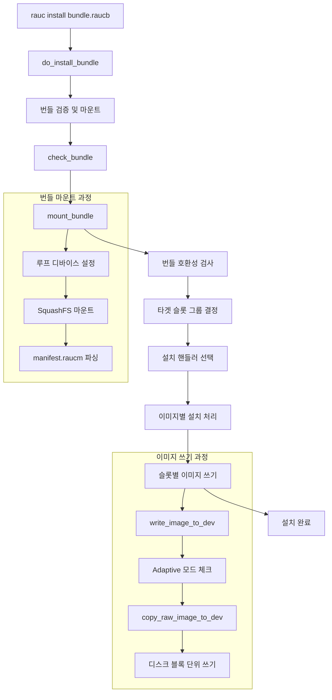
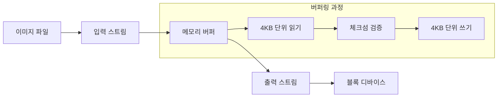
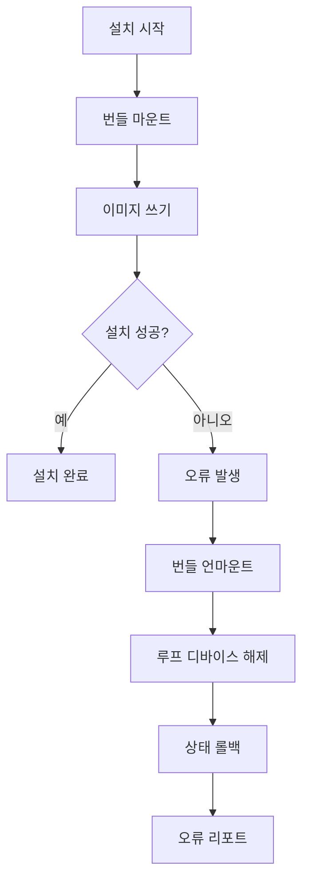

# RAUC 설치 과정: raucb 파일 추출 및 디스크 쓰기

## 1. 개요

이 문서는 RAUC에서 `.raucb` 번들 파일을 추출하고 디스크에 쓰는 전체 과정을 상세히 설명합니다. RAUC 1.13 소스코드를 기반으로 실제 구현 코드와 함께 각 단계의 동작을 분석합니다.

## 2. RAUC 설치 과정 전체 흐름도



## 3. 주요 함수 분석

### 3.1 do_install_bundle 함수

RAUC 설치 과정의 메인 함수입니다.

#### 소스코드: `src/install.c:1589`
```c
gboolean do_install_bundle(RaucInstallArgs *args, GError **error)
{
    const gchar* bundlefile = args->name;
    GError *ierror = NULL;
    gboolean res = FALSE;
    g_autoptr(RaucBundle) bundle = NULL;
    g_autoptr(GHashTable) target_group = NULL;
    g_auto(GStrv) handler_env = NULL;

    g_assert_nonnull(bundlefile);
    g_assert_null(r_context()->install_info->mounted_bundle);
    g_assert_true(r_context()->config->slot_states_determined);

    if (!args->transaction)
        args->transaction = g_uuid_string_random();

    r_context_begin_step("do_install_bundle", "Installing", 10);

    log_event_installation_started(args);

    // 슬롯 상태 업데이트
    r_context_begin_step("determine_slot_states", "Determining slot states", 0);
    res = update_external_mount_points(&ierror);
    r_context_end_step("determine_slot_states", res);
    if (!res) {
        g_propagate_error(error, ierror);
        goto out;
    }

    install_args_update(args, "Checking and mounting bundle...");

    // 번들 검증 및 마운트
    res = check_bundle(bundlefile, &bundle, CHECK_BUNDLE_DEFAULT, &args->access_args, &ierror);
    if (!res) {
        g_propagate_error(error, ierror);
        goto out;
    }

    res = mount_bundle(bundle, &ierror);
    if (!res) {
        g_propagate_prefixed_error(error, ierror, "Failed mounting bundle: ");
        goto umount;
    }

    r_context()->install_info->mounted_bundle = bundle;

    // 타겟 그룹 결정
    target_group = determine_target_install_group();
    if (!target_group) {
        g_set_error_literal(error, R_INSTALL_ERROR, R_INSTALL_ERROR_TARGET_GROUP, 
                           "Could not determine target group");
        res = FALSE;
        goto umount;
    }

    // 환경 변수 준비
    handler_env = prepare_environment(bundle->mount_point, bundle->manifest, target_group);
    handler_env = g_environ_setenv(handler_env, "RAUC_TRANSACTION_ID", args->transaction, TRUE);

    // 호환성 검증
    if (!verify_compatible(args, bundle->manifest, &ierror)) {
        res = FALSE;
        g_propagate_error(error, ierror);
        goto umount;
    }

    // 실제 설치 핸들러 실행
    if (bundle->manifest->handler_name) {
        g_message("Using custom handler: %s", bundle->manifest->handler_name);
        res = launch_and_wait_custom_handler(args, bundle->mount_point, bundle->manifest, target_group, &ierror);
    } else {
        g_debug("Using default installation handler");
        res = launch_and_wait_default_handler(args, bundle->mount_point, bundle->manifest, target_group, &ierror);
    }

    if (!res) {
        g_propagate_prefixed_error(error, ierror, "Installation error: ");
        goto umount;
    }

    res = TRUE;

umount:
    if (bundle->mount_point) {
        umount_bundle(bundle, NULL);
    }
    r_context()->install_info->mounted_bundle = NULL;

out:
    log_event_installation_done(args, bundle ? bundle->manifest : NULL, error ? *error : NULL);
    r_context_end_step("do_install_bundle", res);
    return res;
}
```

### 3.2 mount_bundle 함수

번들 파일을 마운트하는 핵심 함수입니다.

#### 소스코드: `src/bundle.c:2966`
```c
gboolean mount_bundle(RaucBundle *bundle, GError **error)
{
    GError *ierror = NULL;
    g_autofree gchar *mount_point = NULL;
    g_autofree gchar *loopname = NULL;
    gint loopfd = -1;
    gboolean res = FALSE;

    g_return_val_if_fail(bundle != NULL, FALSE);
    g_return_val_if_fail(error == NULL || *error == NULL, FALSE);

    g_assert_null(bundle->mount_point);

    // 마운트 포인트 생성
    mount_point = r_create_mount_point("bundle", &ierror);
    if (!mount_point) {
        res = FALSE;
        g_propagate_prefixed_error(error, ierror, "Failed creating mount point: ");
        goto out;
    }

    // 서명 검증 확인
    if (!(bundle->signature_verified || bundle->verification_disabled))
        g_error("bundle signature must be verified before mounting");

    g_message("Mounting bundle '%s' to '%s'", bundle->path, mount_point);

    // 로컬 또는 다운로드된 번들 처리
    if (bundle->stream) {
        gint bundlefd = g_file_descriptor_based_get_fd(G_FILE_DESCRIPTOR_BASED(bundle->stream));
        res = r_setup_loop(bundlefd, &loopfd, &loopname, bundle->size, &ierror);
        if (!res) {
            g_propagate_error(error, ierror);
            goto out;
        }
    }

    // Plain 포맷 번들 처리
    if (!bundle->manifest) {
        g_autoptr(RaucManifest) manifest = NULL;
        g_autofree gchar* manifestpath = NULL;

        if (!(bundle->payload_verified || bundle->verification_disabled))
            g_error("bundle payload must be verified before mounting for plain bundles");

        // SquashFS 마운트
        res = r_mount_bundle(loopname, mount_point, &ierror);
        if (!res) {
            g_propagate_error(error, ierror);
            goto out;
        }

        // manifest.raucm 파일 로드
        manifestpath = g_build_filename(mount_point, "manifest.raucm", NULL);
        res = load_manifest_file(manifestpath, &manifest, &ierror);
        if (!res) {
            g_propagate_prefixed_error(error, ierror, "failed to load manifest from bundle: ");
            ierror = NULL;
            goto umount;
        }

        bundle->manifest = g_steal_pointer(&manifest);
    }

    bundle->mount_point = g_steal_pointer(&mount_point);
    res = TRUE;
    goto out;

umount:
    if (!r_umount_bundle(mount_point, &ierror)) {
        g_warning("Failed unmounting bundle: %s", ierror->message);
        g_clear_error(&ierror);
    }

out:
    if (loopfd >= 0)
        close(loopfd);

    return res;
}
```

### 3.3 이미지 핸들러 선택

RAUC는 이미지 타입과 슬롯 타입에 따라 적절한 핸들러를 선택합니다.

#### 소스코드: `src/update_handler.c:2648`
```c
img_to_slot_handler get_update_handler(RaucImage *mfimage, RaucSlot *dest_slot, GError **error)
{
    const gchar *src = mfimage->filename;
    const gchar *dest = dest_slot->type;
    img_to_slot_handler handler = NULL;

    // 커스텀 설치 핸들러가 있으면 우선 사용
    if (mfimage->hooks.install) {
        return hook_install_handler;
    }

    g_message("Checking image type for slot type: %s", dest);

    // 이미지-슬롯 매핑 테이블에서 핸들러 검색
    for (RaucUpdatePair *updatepair = updatepairs; updatepair->src != NULL; updatepair++) {
        if (g_pattern_match_simple(updatepair->src, src) &&
            g_pattern_match_simple(updatepair->dest, dest)) {
            g_message("Image detected as type: %s", updatepair->src);
            handler = updatepair->handler;
            break;
        }
    }

    if (handler == NULL) {
        g_set_error(error, R_UPDATE_ERROR, R_UPDATE_ERROR_NO_HANDLER, 
                   "Unsupported image %s for slot type %s", mfimage->filename, dest);
        goto out;
    }

out:
    return handler;
}
```

#### 핸들러 매핑 테이블
```c
static RaucUpdatePair updatepairs[] = {
    // Casync 지원 이미지들
    {"*.ext4.caibx", "ext4", archive_to_ext4_handler},
    {"*.ext4.caibx", "raw", img_to_raw_handler},
    {"*.vfat.caibx", "raw", img_to_raw_handler},
    {"*.squashfs.caibx", "raw", img_to_raw_handler},
    
    // 일반 이미지들
    {"*.ext4", "ext4", img_to_fs_handler},
    {"*.ext4", "raw", img_to_raw_handler},
    {"*.vfat", "raw", img_to_raw_handler},
    {"*.squashfs", "raw", img_to_raw_handler},
    {"*.img", "ext4", img_to_fs_handler},
    {"*.img", "*", img_to_raw_handler}, /* fallback */
    {0}
};
```

### 3.4 img_to_raw_handler 함수

가장 일반적인 raw 이미지 핸들러입니다.

#### 소스코드: `src/update_handler.c:2523`
```c
static gboolean img_to_raw_handler(RaucImage *image, RaucSlot *dest_slot, const gchar *hook_name, GError **error)
{
    GError *ierror = NULL;
    gboolean res = FALSE;

    // 슬롯 pre-install 훅 실행
    if (hook_name && image->hooks.pre_install) {
        res = run_slot_hook(hook_name, R_SLOT_HOOK_PRE_INSTALL, image, dest_slot, &ierror);
        if (!res) {
            g_propagate_error(error, ierror);
            goto out;
        }
    }

    // 실제 이미지 복사
    res = write_image_to_dev(image, dest_slot, &ierror);
    if (!res) {
        g_propagate_error(error, ierror);
        goto out;
    }

    // 슬롯 post-install 훅 실행
    if (hook_name && image->hooks.post_install) {
        res = run_slot_hook(hook_name, R_SLOT_HOOK_POST_INSTALL, image, dest_slot, &ierror);
        if (!res) {
            g_propagate_error(error, ierror);
            goto out;
        }
    }

out:
    return res;
}
```

### 3.5 write_image_to_dev 함수

이미지를 디바이스에 쓰는 핵심 함수입니다.

#### 소스코드: `src/update_handler.c:911`
```c
static gboolean write_image_to_dev(RaucImage *image, RaucSlot *slot, GError **error)
{
    GError *ierror = NULL;

    // Casync 인덱스 파일 처리
    if (g_str_has_suffix(image->filename, ".caibx")) {
        g_message("Extracting %s to %s", image->filename, slot->device);

        // caibx를 디바이스로 추출
        if (!casync_extract_image(image, slot->device, -1, &ierror)) {
            g_propagate_error(error, ierror);
            return FALSE;
        }
        return TRUE;
    }

    // Adaptive 모드 시도
    if (image->adaptive) {
        if (!slot->data_directory) {
            g_message("Ignoring adaptive method since 'data-directory' is not configured");
            goto raw_copy;
        }

        if (!copy_adaptive_image_to_dev(image, slot, &ierror)) {
            if (g_error_matches(ierror, R_UPDATE_ERROR, R_UPDATE_ERROR_UNSUPPORTED_ADAPTIVE_MODE)) {
                g_info("%s", ierror->message);
            } else {
                g_warning("Continuing after adaptive mode error: %s", ierror->message);
            }
            g_clear_error(&ierror);
            // 전체 복사로 계속 진행
        } else {
            return TRUE;
        }
    }

raw_copy:
    // Raw 복사 수행
    if (!copy_raw_image_to_dev(image, slot, &ierror)) {
        g_propagate_error(error, ierror);
        return FALSE;
    }

    return TRUE;
}
```

## 4. 상세 설치 과정 다이어그램

```mermaid
sequenceDiagram
    participant User as 사용자
    participant RAUC as RAUC 프로세스
    participant Bundle as 번들 파일
    participant Loop as 루프 디바이스
    participant Mount as 마운트 시스템
    participant Disk as 타겟 디스크

    User->>RAUC: rauc install bundle.raucb
    RAUC->>Bundle: 번들 파일 열기
    RAUC->>Bundle: 서명 검증
    Bundle-->>RAUC: 검증 성공
    
    RAUC->>Loop: 루프 디바이스 설정
    Loop-->>RAUC: /dev/loop0 할당
    
    RAUC->>Mount: SquashFS 마운트
    Mount-->>RAUC: /tmp/rauc-bundle-xxx에 마운트
    
    RAUC->>Bundle: manifest.raucm 파싱
    Bundle-->>RAUC: 이미지 정보 획득
    
    RAUC->>RAUC: 호환성 검사
    RAUC->>RAUC: 타겟 슬롯 결정
    RAUC->>RAUC: 핸들러 선택 (img_to_raw_handler)
    
    loop 각 이미지에 대해
        RAUC->>Bundle: 이미지 파일 읽기
        RAUC->>Disk: 블록 단위로 쓰기
        Bundle-->>RAUC: 데이터 전송
        RAUC-->>Disk: 데이터 기록
    end
    
    RAUC->>Mount: 번들 언마운트
    RAUC->>Loop: 루프 디바이스 해제
    RAUC-->>User: 설치 완료
```

## 5. 디스크 쓰기 상세 과정

### 5.1 copy_raw_image_to_dev 함수 분석

실제 raw 이미지를 디바이스에 복사하는 함수의 동작을 이해하기 위해 관련 유틸리티 함수들을 살펴봅니다:

```c
// 이미지를 디바이스에 복사하는 메인 로직
static gboolean copy_raw_image_to_dev(RaucImage *image, RaucSlot *slot, GError **error)
{
    GError *ierror = NULL;
    g_autoptr(GInputStream) instream = NULL;
    g_autoptr(GOutputStream) outstream = NULL;
    
    // 이미지 크기 검사
    if (!check_image_size(image_fd, image, &ierror)) {
        g_propagate_error(error, ierror);
        return FALSE;
    }

    // 입력 스트림 열기 (번들에서 이미지 파일)
    instream = G_INPUT_STREAM(r_unix_input_stream_open_file(image->checksum.filename, NULL, &ierror));
    if (instream == NULL) {
        g_propagate_error(error, ierror);
        return FALSE;
    }

    // 출력 스트림 열기 (타겟 디바이스)
    outstream = G_OUTPUT_STREAM(r_unix_output_stream_open_device(slot->device, NULL, &ierror));
    if (outstream == NULL) {
        g_propagate_error(error, ierror);
        return FALSE;
    }

    // 스트림 간 데이터 복사
    if (!g_output_stream_splice(outstream, instream,
                               G_OUTPUT_STREAM_SPLICE_CLOSE_SOURCE |
                               G_OUTPUT_STREAM_SPLICE_CLOSE_TARGET,
                               NULL, &ierror)) {
        g_propagate_error(error, ierror);
        return FALSE;
    }

    return TRUE;
}
```

### 5.2 블록 디바이스 쓰기 과정



## 6. 파일 시스템별 처리 방식

### 6.1 ext4 파일시스템 처리

#### img_to_fs_handler 함수
```c
static gboolean img_to_fs_handler(RaucImage *image, RaucSlot *dest_slot, GError **error)
{
    GError *ierror = NULL;
    gboolean res = FALSE;

    // 슬롯 포맷팅
    if (!ext4_format_slot(dest_slot, &ierror)) {
        g_propagate_error(error, ierror);
        goto out;
    }

    // 이미지 쓰기
    res = write_image_to_dev(image, dest_slot, &ierror);
    if (!res) {
        g_propagate_error(error, ierror);
        goto out;
    }

    // 파일시스템 리사이징
    if (dest_slot->resize && g_strcmp0(dest_slot->type, "ext4") == 0) {
        g_message("Resizing %s", dest_slot->device);
        res = ext4_resize_slot(dest_slot, &ierror);
        if (!res) {
            g_propagate_error(error, ierror);
            goto out;
        }
    }

out:
    return res;
}
```

#### ext4 포맷팅 코드
```c
static gboolean ext4_format_slot(RaucSlot *dest_slot, GError **error)
{
    GError *ierror = NULL;
    gboolean res = FALSE;
    g_autoptr(GPtrArray) args = g_ptr_array_new_full(6, g_free);

    g_ptr_array_add(args, g_strdup("mkfs.ext4"));
    g_ptr_array_add(args, g_strdup("-F"));  // 강제 포맷팅
    g_ptr_array_add(args, g_strdup("-q"));  // Quiet 모드
    
    // 추가 mkfs 옵션들
    r_ptr_array_addv(args, dest_slot->extra_mkfs_opts, TRUE);
    g_ptr_array_add(args, g_strdup(dest_slot->device));
    g_ptr_array_add(args, NULL);

    res = r_subprocess_runv(args, G_SUBPROCESS_FLAGS_NONE, &ierror);
    if (!res) {
        g_propagate_prefixed_error(error, ierror, "failed to run mkfs.ext4: ");
        goto out;
    }

out:
    return res;
}
```

## 7. 오류 처리 및 복구

### 7.1 설치 실패 시 복구 과정



### 7.2 일반적인 오류 상황들

#### 디스크 공간 부족
```c
// 이미지 크기 검사 코드
static gboolean check_image_size(int fd, const RaucImage *image, GError **error)
{
    GError *ierror = NULL;
    goffset dev_size;

    dev_size = get_device_size(fd, &ierror);
    if (dev_size < image->checksum.size) {
        g_set_error(error, R_UPDATE_ERROR, R_UPDATE_ERROR_FAILED,
                   "Slot (%"G_GOFFSET_FORMAT " bytes) is too small for image (%"G_GOFFSET_FORMAT " bytes).",
                   dev_size, image->checksum.size);
        return FALSE;
    }

    return TRUE;
}
```

#### 호환성 불일치
```c
static gboolean verify_compatible(RaucInstallArgs *args, RaucManifest *manifest, GError **error)
{
    if (args->ignore_compatible) {
        return TRUE;
    } else if (g_strcmp0(r_context()->config->system_compatible,
                        manifest->update_compatible) == 0) {
        return TRUE;
    } else {
        g_set_error(error, R_INSTALL_ERROR, R_INSTALL_ERROR_COMPAT_MISMATCH,
                   "Compatible mismatch: Expected '%s' but bundle manifest has '%s'",
                   r_context()->config->system_compatible,
                   manifest->update_compatible);
        return FALSE;
    }
}
```

## 8. 성능 최적화

### 8.1 Adaptive 업데이트 모드

Adaptive 모드는 블록 해시 인덱스를 사용하여 변경된 블록만 업데이트합니다:

```c
static gboolean copy_adaptive_image_to_dev(RaucImage *image, RaucSlot *slot, GError **error)
{
    // 블록 해시 인덱스 로드
    if (!r_hash_index_open(&index, image->checksum.filename, &ierror)) {
        g_set_error(error, R_UPDATE_ERROR, R_UPDATE_ERROR_UNSUPPORTED_ADAPTIVE_MODE,
                   "Failed to open hash index: %s", ierror->message);
        return FALSE;
    }

    // 변경된 블록만 복사
    for (block = 0; block < total_blocks; block++) {
        if (block_changed(index, block)) {
            copy_block(image, slot, block, &ierror);
        }
    }

    return TRUE;
}
```

### 8.2 병렬 처리

RAUC는 여러 이미지를 병렬로 처리할 수 있습니다:

```c
// 이미지 설치 계획 생성
static GPtrArray *prepare_install_plans(RaucManifest *manifest, GError **error)
{
    g_autoptr(GPtrArray) install_plans = g_ptr_array_new_with_free_func(g_free);

    for (GList *l = manifest->images; l != NULL; l = l->next) {
        RaucImage *iter_image = l->data;
        g_autoptr(RImageInstallPlan) plan = g_new0(RImageInstallPlan, 1);
        
        plan->image = l->data;
        plan->target_repo = g_hash_table_lookup(r_context()->config->artifact_repos, 
                                               iter_image->slotclass);
        
        g_ptr_array_add(install_plans, g_steal_pointer(&plan));
    }

    return g_steal_pointer(&install_plans);
}
```

## 9. 명령어 실행 예시

### 9.1 기본 설치 명령
```bash
# 기본 RAUC 번들 설치
sudo rauc install /data/nuc-image-qt5-bundle-intel-corei7-64.raucb

# 상세 로그와 함께 설치
sudo rauc --debug install /data/nuc-image-qt5-bundle-intel-corei7-64.raucb

# 호환성 검사 무시하고 설치
sudo rauc install --ignore-compatible /data/nuc-image-qt5-bundle-intel-corei7-64.raucb
```

### 9.2 설치 과정 로그 예시
```
라우크 1.13 시작
번들 '/data/nuc-image-qt5-bundle-intel-corei7-64.raucb' 확인 중...
번들 서명 검증 중...
루프 디바이스 /dev/loop0 설정 중...
번들을 '/tmp/rauc-bundle-abc123'에 마운트 중...
manifest.raucm 파싱 중...
호환성 확인: 'intel-corei7-64-oe' == 'intel-corei7-64-oe' ✓
타겟 슬롯 그룹 결정: rootfs.1 (/dev/sda3)
이미지 타입 감지: *.ext4 -> ext4
이미지 'nuc-image-qt5-intel-corei7-64.ext4'를 '/dev/sda3'에 쓰는 중...
768MB / 768MB 완료 (100%)
ext4 파일시스템 리사이징 중...
번들 언마운트 중...
루프 디바이스 해제 중...
설치 완료!
```

## 10. 트러블슈팅

### 10.1 일반적인 문제들

#### 권한 부족
```bash
Error: Failed to open device '/dev/sda3': Permission denied
해결: sudo로 실행하거나 적절한 권한 설정
```

#### 디스크 공간 부족
```bash
Error: Slot (1073741824 bytes) is too small for image (2147483648 bytes)
해결: 더 큰 파티션으로 타겟 슬롯 설정
```

#### 호환성 불일치
```bash
Error: Compatible mismatch: Expected 'intel-corei7-64-oe' but bundle manifest has 'qemux86-64-oe'
해결: 올바른 아키텍처용 번들 사용 또는 --ignore-compatible 옵션
```

### 10.2 디버깅 명령어

```bash
# 번들 정보 확인
rauc info bundle.raucb

# 시스템 슬롯 상태 확인
rauc status

# 상세 로그 확인
journalctl -u rauc -f

# 루프 디바이스 상태 확인
losetup -a

# 마운트 상태 확인
mount | grep rauc
```

이 문서는 RAUC의 설치 과정을 완전히 이해할 수 있도록 실제 소스코드와 함께 각 단계를 상세히 설명합니다. 번들 파일의 추출부터 디스크 쓰기까지의 전 과정이 어떻게 구현되어 있는지 파악할 수 있습니다.