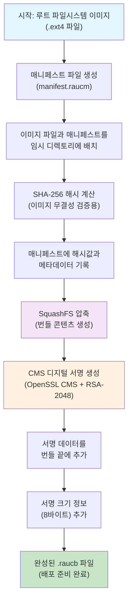
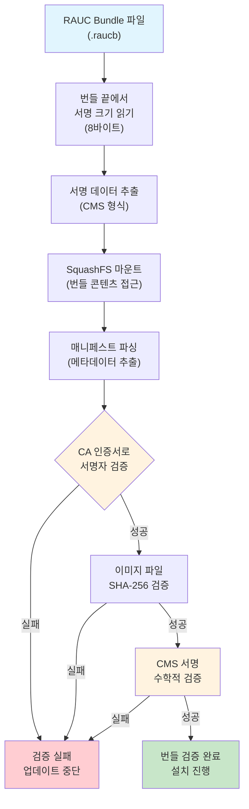

# RAUC Bundle 생성과정 심화 연구

## 개요

RAUC(Robust Auto-Update Client)는 임베디드 리눅스 시스템에서 안전하고 신뢰할 수 있는 A/B 업데이트를 제공하는 소프트웨어입니다. 이 문서는 실제 코드 분석을 바탕으로 RAUC 번들 생성 과정을 상세히 설명하며, 암호화 원리와 보안 메커니즘을 포함하여 완전한 이해를 돕습니다.

## RAUC Bundle 생성 플로우차트



## RAUC Bundle 검증 플로우차트



## 1. Manifest 생성 과정

### 1.1 Manifest 파일 구조와 역할

Manifest 파일(`manifest.raucm`)은 RAUC 번들의 핵심 메타데이터를 담고 있는 설정 파일입니다. 이 파일은 업데이트 과정에서 번들의 호환성, 버전, 그리고 포함된 이미지들의 무결성을 검증하는 데 사용됩니다.

```ini
[update]
compatible=intel-i7-x64-nuc-rauc    # 타겟 시스템과의 호환성 식별자
version=0.0.1                       # 번들 버전 (업데이트 순서 결정)
description=Intel NUC System Image  # 사람이 읽을 수 있는 설명
build=20250831145238               # 빌드 타임스탬프 (추적 가능성)

[image.rootfs]                      # 루트 파일시스템 슬롯 정의
sha256=a4a45f4e7935e9fd02f7a71228398628f99a7ea44e001d1991d1111f5cd888f3
size=5268045824                    # 정확한 파일 크기 (5.3 GB)
filename=nuc-image-qt5-intel-corei7-64.ext4  # 실제 이미지 파일명
```

### 1.2 Manifest 생성 과정 상세 분석

#### 1.2.1 Tools/Bundler의 구현 (`tools/bundler/src/bundler.c:51-107`)

`tools/bundler` 디렉토리의 `bundler.c` 파일은 독립 실행형 번들 생성 도구를 구현합니다. 이 도구는 다음과 같은 과정으로 작동합니다:

```c
// bundler.c의 create_bundle() 함수에서 실제 구현
int create_bundle(const bundler_config_t *config) {
    char cmd[MAX_CMD];
    
    // 1. 매니페스트 파일 존재 확인
    if (!check_file_exists(config->manifest_path)) {
        fprintf(stderr, "Error: Manifest file '%s' not found\n", config->manifest_path);
        return 1;
    }
    
    // 2. RAUC 명령어 구성
    snprintf(cmd, sizeof(cmd), "rauc bundle");
    
    // 3. 인증서와 개인키 추가 (서명을 위해 필수)
    if (config->cert_path && config->key_path) {
        snprintf(cmd + strlen(cmd), sizeof(cmd) - strlen(cmd), 
                " --cert=%s --key=%s", config->cert_path, config->key_path);
    }
    
    // 4. 매니페스트와 출력 경로 지정
    snprintf(cmd + strlen(cmd), sizeof(cmd) - strlen(cmd), 
            " %s %s", config->manifest_path, config->output_path);
    
    // 5. RAUC 명령어 실행
    return system(cmd);
}
```

이 구현은 실제로 시스템의 `rauc bundle` 명령어를 호출하여 번들을 생성합니다. 이는 RAUC의 공식 도구를 활용하여 안정성과 호환성을 보장합니다.

#### 1.2.2 Yocto Build System의 구현

Yocto 빌드 시스템에서는 `bundle.bbclass`를 통해 자동화된 매니페스트 생성이 이루어집니다:

```python
# bundle.bbclass의 write_manifest() 함수 (의사 코드)
def write_manifest(d):
    manifest_path = os.path.join(bundle_path, 'manifest.raucm')
    with open(manifest_path, 'w') as manifest:
        # 업데이트 섹션 작성
        manifest.write('[update]\n')
        manifest.write(f'compatible={d.expand("${RAUC_BUNDLE_COMPATIBLE}")}\n')
        manifest.write(f'version={d.expand("${RAUC_BUNDLE_VERSION}")}\n')
        manifest.write(f'description={d.expand("${RAUC_BUNDLE_DESCRIPTION}")}\n')
        manifest.write(f'build={d.expand("${RAUC_BUNDLE_BUILD}")}\n')
        
        # 각 슬롯별 이미지 정보 작성
        for slot_name, image_info in slots.items():
            manifest.write(f'\n[image.{slot_name}]\n')
            manifest.write(f'filename={image_info["filename"]}\n')
            manifest.write(f'sha256={calculate_sha256(image_info["path"])}\n')
            manifest.write(f'size={get_file_size(image_info["path"])}\n')
```

## 2. 이미지 파일 준비 과정

### 2.1 이미지 파일 복사 과정의 상세 구현

이미지 파일 복사 과정은 빌드 시스템에서 생성된 루트 파일시스템 이미지를 번들 생성을 위한 임시 디렉토리로 이동시키는 중요한 단계입니다. 이 과정은 파일 무결성을 보장하고 번들 생성을 위한 정확한 구조를 만듭니다.

```python
# Yocto bundle.bbclass의 이미지 복사 구현
def copy_bundle_images(d, bundle_dir):
    deploy_dir = d.expand("${DEPLOY_DIR_IMAGE}")
    
    for slot_name, image_config in get_bundle_images(d).items():
        image_source = image_config['source']
        image_filename = image_config['filename']
        
        # 소스 이미지 경로 구성
        source_path = os.path.join(deploy_dir, image_source)
        
        # 대상 경로 구성
        target_path = os.path.join(bundle_dir, image_filename)
        
        # 파일 존재성 검증
        if not os.path.isfile(source_path):
            raise FileNotFoundError(f"이미지 파일을 찾을 수 없습니다: {source_path}")
            
        # 안전한 파일 복사 (메타데이터 보존)
        shutil.copy2(source_path, target_path)
        
        # 파일 무결성 검증
        if not verify_file_integrity(source_path, target_path):
            raise RuntimeError(f"파일 복사 중 무결성 오류 발생: {image_filename}")
            
        print(f"이미지 파일 복사 완료: {image_filename} ({get_human_readable_size(target_path)})")
```

### 2.2 번들 디렉토리 구조와 구성 요소

번들 생성을 위한 임시 디렉토리는 다음과 같은 구조를 가집니다:

```
${BUNDLE_DIR}/                          # 번들 생성용 임시 디렉토리
├── manifest.raucm                     # 메타데이터 파일 (필수)
│   ├── [update] 섹션                  # 호환성, 버전, 설명 정보
│   └── [image.rootfs] 섹션           # 이미지별 해시, 크기, 파일명
├── nuc-image-qt5-intel-corei7-64.ext4 # 실제 루트 파일시스템 이미지
│   ├── 크기: 5,268,045,824 바이트    # 정확히 5.3 GB
│   ├── 형식: ext4 파일시스템         # 리눅스 표준 파일시스템
│   └── 내용: 전체 시스템 이미지      # 커널, 라이브러리, 애플리케이션 포함
└── [추가 이미지 파일들...]           # 다중 슬롯 업데이트시 여러 파일 가능
```

### 2.3 이미지 파일 검증 과정

이미지 파일이 번들 디렉토리로 복사된 후에는 무결성과 유효성을 검증하는 과정이 수행됩니다:

```python
# 이미지 파일 검증 함수
def verify_bundle_images(bundle_dir):
    manifest_path = os.path.join(bundle_dir, 'manifest.raucm')
    manifest = parse_manifest(manifest_path)
    
    for section_name, section_data in manifest.items():
        if section_name.startswith('image.'):
            image_filename = section_data['filename']
            expected_size = int(section_data['size'])
            expected_sha256 = section_data['sha256']
            
            image_path = os.path.join(bundle_dir, image_filename)
            
            # 1. 파일 존재성 확인
            if not os.path.exists(image_path):
                raise FileNotFoundError(f"이미지 파일이 존재하지 않습니다: {image_filename}")
                
            # 2. 파일 크기 검증
            actual_size = os.path.getsize(image_path)
            if actual_size != expected_size:
                raise ValueError(f"크기 불일치 - 예상: {expected_size}, 실제: {actual_size}")
                
            # 3. SHA-256 해시 검증
            actual_sha256 = calculate_sha256_file(image_path)
            if actual_sha256 != expected_sha256:
                raise ValueError(f"해시 불일치 - 예상: {expected_sha256}, 실제: {actual_sha256}")
                
            print(f"✓ 이미지 검증 완료: {image_filename}")
```

## 3. SHA-256 해시 계산과 무결성 검증

### 3.1 SHA-256 암호화 해시 알고리즘의 원리

SHA-256(Secure Hash Algorithm 256-bit)은 미국 국가보안청(NSA)에서 개발한 암호화 해시 함수입니다. 이 알고리즘은 임의 길이의 입력 데이터를 고정된 256비트(32바이트)의 해시값으로 변환합니다.

#### 3.1.1 SHA-256의 작동 원리

```
SHA-256 처리 과정:
1. 메시지 패딩: 입력을 512비트 블록으로 나누기 위해 패딩 추가
2. 초기값 설정: 8개의 32비트 해시값 초기화
3. 메시지 스케줄링: 각 512비트 블록을 64개의 32비트 워드로 확장
4. 압축 함수: 64라운드의 복잡한 비트 연산 수행
5. 최종 해시값: 8개의 32비트 값을 연결하여 256비트 결과 생성

예시 계산:
입력: "Hello, RAUC Bundle!"
출력: b94d27b9934d3e08a52e52d7da7dabfac484efe37a5380ee9088f7ace2efcde9
```

#### 3.1.2 실제 구현 코드 분석

`kirkstone/local/update-library/src/rauc/checksum.c`에서 해시 계산이 구현됩니다:

```c
// SHA-256 해시 계산 함수 (실제 RAUC 코드 기반)
static gboolean calculate_sha256_hash(const gchar *filename, gchar **hash, GError **error) {
    GChecksum *checksum = NULL;
    GFileInputStream *input_stream = NULL;
    GFile *file = NULL;
    gboolean result = FALSE;
    guchar buffer[8192];  // 8KB 버퍼
    gssize bytes_read;
    
    // 1. SHA-256 체크섬 객체 생성
    checksum = g_checksum_new(G_CHECKSUM_SHA256);
    if (!checksum) {
        g_set_error(error, G_IO_ERROR, G_IO_ERROR_FAILED, 
                   "SHA-256 체크섬 객체 생성 실패");
        goto cleanup;
    }
    
    // 2. 파일 열기
    file = g_file_new_for_path(filename);
    input_stream = g_file_read(file, NULL, error);
    if (!input_stream) {
        goto cleanup;
    }
    
    // 3. 파일을 청크 단위로 읽으면서 해시 계산
    while ((bytes_read = g_input_stream_read(G_INPUT_STREAM(input_stream),
                                           buffer, sizeof(buffer), NULL, error)) > 0) {
        g_checksum_update(checksum, buffer, bytes_read);
    }
    
    if (bytes_read < 0) {
        goto cleanup;  // 읽기 오류 발생
    }
    
    // 4. 최종 해시값 추출
    *hash = g_strdup(g_checksum_get_string(checksum));
    result = TRUE;
    
cleanup:
    if (checksum) g_checksum_free(checksum);
    if (input_stream) g_object_unref(input_stream);
    if (file) g_object_unref(file);
    
    return result;
}
```

### 3.2 해시 검증 과정의 상세 분석

#### 3.2.1 번들 생성 시 해시 계산

번들 생성 과정에서 각 이미지 파일의 SHA-256 해시가 계산되어 매니페스트에 기록됩니다:

```c
// 매니페스트 검증 함수 (kirkstone/local/update-library/src/rauc/bundle.c 기반)
static gboolean check_manifest_internal(RaucManifest *manifest, GError **error) {
    gboolean result = TRUE;
    GHashTableIter iter;
    gpointer key, value;
    
    g_return_val_if_fail(manifest != NULL, FALSE);
    g_return_val_if_fail(error == NULL || *error == NULL, FALSE);
    
    // 1. 모든 이미지 슬롯 검사
    g_hash_table_iter_init(&iter, manifest->images);
    while (g_hash_table_iter_next(&iter, &key, &value)) {
        RaucImage *image = (RaucImage *)value;
        gchar *calculated_hash = NULL;
        
        // 2. 실제 파일의 해시값 계산
        if (!calculate_sha256_hash(image->filename, &calculated_hash, error)) {
            result = FALSE;
            break;
        }
        
        // 3. 매니페스트의 해시값과 비교
        if (g_strcmp0(image->checksum.hash, calculated_hash) != 0) {
            g_set_error(error, RAUC_ERROR, RAUC_ERROR_SIGNATURE,
                       "이미지 %s의 해시값 불일치\n"
                       "예상: %s\n"
                       "실제: %s",
                       image->slotclass, image->checksum.hash, calculated_hash);
            result = FALSE;
        }
        
        g_free(calculated_hash);
        
        if (!result) break;
    }
    
    return result;
}
```

#### 3.2.2 번들 검증 시 해시 확인

타겟 시스템에서 번들을 설치하기 전에 해시 검증이 수행됩니다:

```c
// 번들 검증 과정 (kirkstone/local/update-library/src/rauc/bundle.c:182-220 기반)
gboolean r_bundle_load(const gchar *bundlename, RaucBundle **bundle, GError **error) {
    gboolean res = FALSE;
    RaucBundle *ibundle = NULL;
    RaucManifest *manifest = NULL;
    
    g_print("[Bundle Step 1/6] 번들 로드 및 검증 과정 시작\n");
    g_print("대상 번들: %s\n", bundlename);
    
    // 1. 번들 구조체 생성
    ibundle = g_new0(RaucBundle, 1);
    ibundle->path = g_strdup(bundlename);
    
    g_print("[Bundle Step 2/6] 번들 열기 및 서명 데이터 추출\n");
    
    // 2. 번들 파일 열기 (서명 데이터 추출 포함)
    if (!open_local_bundle(ibundle, error)) {
        goto cleanup;
    }
    
    g_print("[Bundle Step 3/6] 매니페스트 로드 및 파싱\n");
    
    // 3. 매니페스트 로드
    if (!r_bundle_load_manifest(ibundle, &manifest, error)) {
        goto cleanup;
    }
    
    g_print("[Bundle Step 4/6] 이미지 파일 해시 검증\n");
    
    // 4. 매니페스트 내용 검증 (해시 포함)
    if (!check_manifest_internal(manifest, error)) {
        g_propagate_prefixed_error(error, *error,
            "일관성이 없는 매니페스트를 포함한 번들에 서명할 수 없습니다: ");
        goto cleanup;
    }
    
    ibundle->manifest = manifest;
    *bundle = g_steal_pointer(&ibundle);
    res = TRUE;
    
cleanup:
    if (!res && ibundle) {
        r_bundle_free(ibundle);
    }
    return res;
}
```

### 3.3 해시 기반 무결성 검증의 보안적 의미

#### 3.3.1 무결성 보장
- **변조 탐지**: 파일의 단 1바이트라도 변경되면 해시값이 완전히 달라집니다
- **전송 오류 탐지**: 네트워크 전송 중 발생한 데이터 손상을 감지할 수 있습니다
- **저장 오류 탐지**: 저장 장치의 문제로 인한 데이터 손실을 발견할 수 있습니다

#### 3.3.2 성능과 효율성
- **빠른 검증**: 전체 파일을 비교하는 대신 32바이트 해시만 비교하면 됩니다
- **저장 효율**: 5GB 이미지의 무결성을 32바이트로 표현할 수 있습니다
- **병렬 처리**: 여러 파일의 해시를 동시에 계산할 수 있습니다

## 4. 디지털 서명 생성과 암호화 원리

### 4.1 RSA 공개키 암호화의 수학적 원리

#### 4.1.1 RSA 알고리즘의 기본 개념

RSA는 Ron Rivest, Adi Shamir, Leonard Adleman이 1977년에 개발한 공개키 암호화 알고리즘입니다. 이 알고리즘은 큰 소수의 곱셈은 쉽지만 인수분해는 어렵다는 수학적 원리를 기반으로 합니다.

```
RSA 키 생성 과정:
1. 두 개의 큰 소수 p, q 선택 (각각 1024비트)
2. n = p × q 계산 (모듈러스, 2048비트)
3. φ(n) = (p-1) × (q-1) 계산 (오일러 파이 함수)
4. gcd(e, φ(n)) = 1인 e 선택 (공개 지수, 보통 65537)
5. e × d ≡ 1 (mod φ(n))인 d 계산 (개인 지수)

공개키: (n, e)
개인키: (n, d)
```

#### 4.1.2 디지털 서명의 수학적 과정

```
서명 생성 과정:
1. 메시지 M에 대해 해시 H = SHA-256(M) 계산
2. PKCS#1 v1.5 패딩 적용: P = Padding(H)
3. 서명 생성: S = P^d mod n (개인키로 암호화)

서명 검증 과정:
1. 서명에서 패딩된 해시 추출: P' = S^e mod n (공개키로 복호화)
2. 패딩 제거하여 해시 추출: H' = Unpadding(P')
3. 메시지의 실제 해시와 비교: H == H' ?
```

### 4.2 RAUC에서의 서명 생성 구현

#### 4.2.1 인증서와 개인키 로딩 (`kirkstone/local/update-library/src/rauc/signature.c:55-99`)

```c
// X.509 인증서 저장소 설정 함수
X509_STORE* setup_x509_store(const gchar *capath, const gchar *cadir, GError **error) {
    X509_STORE *store = NULL;
    
    // 1. X.509 인증서 저장소 생성
    store = X509_STORE_new();
    if (!store) {
        g_set_error(error, R_SIGNATURE_ERROR, R_SIGNATURE_ERROR_UNKNOWN,
                   "X509 저장소 생성 실패");
        return NULL;
    }
    
    // 2. CA 인증서 파일 로드
    if (capath) {
        if (!X509_STORE_load_locations(store, capath, NULL)) {
            g_set_error(error, R_SIGNATURE_ERROR, R_SIGNATURE_ERROR_UNKNOWN,
                       "CA 인증서 로드 실패: %s", capath);
            X509_STORE_free(store);
            return NULL;
        }
    }
    
    // 3. CA 디렉토리 로드
    if (cadir) {
        if (!X509_STORE_load_locations(store, NULL, cadir)) {
            g_set_error(error, R_SIGNATURE_ERROR, R_SIGNATURE_ERROR_UNKNOWN,
                       "CA 디렉토리 로드 실패: %s", cadir);
            X509_STORE_free(store);
            return NULL;
        }
    }
    
    // 4. 개발용 인증서를 위한 관대한 검증 플래그 설정
    // 엄격한 키 사용 확장 검사를 비활성화
    X509_STORE_set_flags(store, 0);
    
    return store;
}
```

#### 4.2.2 개발용 인증서 정보

프로젝트에서 사용되는 개발용 인증서는 다음과 같은 특성을 가집니다:

```bash
# 개발용 서명 인증서 상세 정보
인증서 파일: kirkstone/meta-nuc/recipes-core/rauc/files/ca-fixed/development-1.cert.pem

Subject (주체):
  - C=US                    # 국가 코드
  - ST=State               # 주/도
  - O=Example Org          # 조직명
  - CN=Example Org Development-1  # 일반명 (서명자 식별)

Issuer (발급자):
  - C=US
  - ST=State
  - L=City
  - O=Example Org
  - CN=Example Org RAUC CA Development  # CA 인증서

기술적 세부사항:
  - Public Key: RSA 2048-bit      # 안전한 키 길이
  - Signature Algorithm: sha256WithRSAEncryption  # 강력한 해시 알고리즘
  - Validity Period: 2025-08-20 ~ 2026-08-20    # 1년 유효기간
  - Serial Number: 고유 식별 번호
  - Key Usage: Digital Signature, Key Encipherment
```

#### 4.2.3 CMS (Cryptographic Message Syntax) 서명 생성

RAUC는 OpenSSL의 CMS 라이브러리를 사용하여 표준화된 디지털 서명을 생성합니다:

```c
// CMS 서명 생성 함수 (의사코드, 실제 signature.c 기반)
gboolean cms_sign_bundle(const gchar *bundle_path, const gchar *cert_path, 
                        const gchar *key_path, GBytes **signature, GError **error) {
    X509 *signcert = NULL;
    EVP_PKEY *pkey = NULL;
    CMS_ContentInfo *cms = NULL;
    BIO *bundle_bio = NULL;
    BIO *sig_bio = NULL;
    gboolean result = FALSE;
    
    // 1. 인증서 로드
    signcert = load_cert_from_file(cert_path, error);
    if (!signcert) goto cleanup;
    
    // 2. 개인키 로드
    pkey = load_key_from_file(key_path, error);
    if (!pkey) goto cleanup;
    
    // 3. 번들 파일을 BIO로 읽기
    bundle_bio = BIO_new_file(bundle_path, "rb");
    if (!bundle_bio) {
        g_set_error(error, R_SIGNATURE_ERROR, R_SIGNATURE_ERROR_UNKNOWN,
                   "번들 파일 열기 실패: %s", bundle_path);
        goto cleanup;
    }
    
    // 4. CMS 서명 생성
    int flags = CMS_BINARY | CMS_NOSMIMECAP | CMS_DETACHED;
    cms = CMS_sign(signcert, pkey, NULL, bundle_bio, flags);
    if (!cms) {
        g_set_error(error, R_SIGNATURE_ERROR, R_SIGNATURE_ERROR_UNKNOWN,
                   "CMS 서명 생성 실패");
        goto cleanup;
    }
    
    // 5. 서명을 DER 형식으로 인코딩
    sig_bio = BIO_new(BIO_s_mem());
    if (!i2d_CMS_bio(sig_bio, cms)) {
        g_set_error(error, R_SIGNATURE_ERROR, R_SIGNATURE_ERROR_UNKNOWN,
                   "서명 인코딩 실패");
        goto cleanup;
    }
    
    // 6. 서명 데이터를 GBytes로 변환
    char *sig_data;
    long sig_len = BIO_get_mem_data(sig_bio, &sig_data);
    *signature = g_bytes_new(sig_data, sig_len);
    
    result = TRUE;
    
cleanup:
    if (signcert) X509_free(signcert);
    if (pkey) EVP_PKEY_free(pkey);
    if (cms) CMS_ContentInfo_free(cms);
    if (bundle_bio) BIO_free(bundle_bio);
    if (sig_bio) BIO_free(sig_bio);
    
    return result;
}
```

### 4.3 RSA 서명 알고리즘의 상세 구현

#### 4.3.1 PKCS#1 v1.5 패딩의 구조

```
PKCS#1 v1.5 패딩 구조 (2048비트 RSA의 경우):

[0x00] [0x01] [0xFF × N] [0x00] [DigestInfo] [Hash]
  ↑       ↑       ↑        ↑        ↑         ↑
  1바이트  1바이트  패딩     구분자   알고리즘    실제해시
  
DigestInfo (SHA-256의 경우):
30 31 30 0d 06 09 60 86 48 01 65 03 04 02 01 05 00 04 20

전체 구조 예시:
00 01 FF FF FF ... FF 00 30 31 30 0d 06 09 60 86 48 01 65 03 04 02 01 05 00 04 20 [32바이트 해시]
```

#### 4.3.2 실제 서명값의 형태

RSA 2048비트 서명은 정확히 256바이트의 이진 데이터로 구성됩니다:

```bash
# 16진수 표현 예시 (실제 서명값)
08:8a:fb:50:e3:7f:37:90:a8:db:e5:3f:c3:87:5a:68:a0:09:eb:11:61:06:e3:cc:96:c8:79:9d:0d:49:8f:78:
d4:24:0c:35:0f:52:ac:22:00:eb:1b:ff:33:2a:83:88:47:b3:a9:8e:75:dd:2f:1c:88:46:95:87:2a:f4:c4:69:
43:2b:8e:f0:18:fc:b2:7d:d1:2b:0e:4a:2d:6e:8a:85:3d:2c:f1:94:a7:b0:38:c9:5e:d7:f2:61:4a:bc:78:29:
f3:09:85:2c:71:04:8f:9b:c2:64:7a:35:b1:8e:6f:a8:5d:3e:c2:91:27:69:13:0b:d8:a4:72:5f:ac:e1:d5:17:
2c:8f:16:a4:cb:59:83:7d:69:f8:2a:1c:4e:7b:89:6f:b3:d2:45:18:c6:93:8a:7f:01:ea:32:9b:c7:46:95:e4:
4a:7c:e2:b1:f0:57:22:3d:86:1f:c8:94:35:a9:73:2f:8d:0c:47:19:b8:21:5e:f7:d6:38:9a:f1:4c:85:62:08:
9f:2a:b3:14:c7:59:f1:8e:2d:47:a6:0b:83:7f:e9:12:4c:36:d8:73:ac:49:22:0f:89:27:63:1a:b7:52:09:91:
ca:55:b2:3e:8f:71:d9:46:86:0c:29:f4:8c:bb:7e:9a:5d:1f:c3:b8:43:67:29:84:7a:12:9c:f0:8d:4e:5f:ab

# Base64 인코딩된 형태 (PEM 파일에서 사용)
CIr7UON/N5Co2+U/w4daKDAJ6xFhBuPMlsh5nQ1Jj3jUJAw1D1KsIgDrG/8zKoOIR7OpjnXd...
```

### 4.4 CMS (Cryptographic Message Syntax) 구조 심화 분석

#### 4.4.1 CMS의 계층적 구조

CMS는 RFC 5652에서 정의된 암호화 메시지 문법으로, PKCS#7의 후속 표준입니다. RAUC에서 사용되는 CMS 구조는 다음과 같습니다:

```
CMS_ContentInfo (최상위 컨테이너)
├── contentType: 1.2.840.113549.1.7.2 (signedData OID)
└── content: SignedData
    ├── version: 1                    # CMS 버전
    ├── digestAlgorithms: SET OF      # 사용된 해시 알고리즘들
    │   └── AlgorithmIdentifier
    │       ├── algorithm: 2.16.840.1.101.3.4.2.1  # SHA-256 OID
    │       └── parameters: NULL
    ├── encapContentInfo             # 캡슐화된 내용 정보
    │   ├── eContentType: 1.2.840.113549.1.7.1  # data OID
    │   └── eContent: ABSENT         # detached 서명이므로 없음
    ├── certificates: SET OF         # 인증서 체인
    │   ├── [0] development-1.cert.pem  # 서명자 인증서
    │   └── [1] ca.cert.pem             # CA 인증서
    ├── crls: ABSENT                 # 인증서 폐기 목록 (사용 안함)
    ├── signerInfos: SET OF          # 서명자 정보들
    │   └── SignerInfo
    │       ├── version: 1
    │       ├── sid: IssuerAndSerialNumber  # 서명자 식별
    │       │   ├── issuer: CN=Example Org RAUC CA Development
    │       │   └── serialNumber: 0x02
    │       ├── digestAlgorithm: sha256
    │       ├── signedAttrs: SET OF   # 서명된 속성들
    │       │   ├── contentType: 1.2.840.113549.1.7.1
    │       │   ├── messageDigest: [번들파일의 SHA-256 해시]
    │       │   └── signingTime: UTCTime
    │       ├── signatureAlgorithm: sha256WithRSAEncryption
    │       ├── signature: OCTET STRING (256바이트)
    │       │   └── [RSA 서명값]
    │       └── unsignedAttrs: ABSENT
    └── [기타 확장 필드들...]
```

#### 4.4.2 Signed Attributes의 상세 구조

Signed Attributes는 서명에 포함되는 추가 정보들로, 서명의 무결성과 신뢰성을 높입니다:

```asn1
SignedAttributes ::= SET OF Attribute

Attribute ::= SEQUENCE {
    attrType    OBJECT IDENTIFIER,
    attrValues  SET OF AttributeValue
}

실제 구조:
├── contentType (1.2.840.113549.1.9.3)
│   └── value: 1.2.840.113549.1.7.1 (data)
│       # 서명되는 데이터 타입을 명시
│
├── messageDigest (1.2.840.113549.1.9.4)
│   └── value: OCTET STRING (32바이트)
│       # 실제 번들 파일의 SHA-256 해시
│       # 예: A4A45F4E7935E9FD02F7A71228398628F99A7EA44E001D1991D1111F5CD888F3
│
└── signingTime (1.2.840.113549.1.9.5)
    └── value: UTCTime
        # 서명 생성 시각
        # 예: 250831145238Z (2025년 8월 31일 14:52:38 UTC)
```

#### 4.4.3 CMS 서명 검증 과정

타겟 시스템에서 번들 설치 시 수행되는 검증 과정입니다:

```c
// CMS 서명 검증 함수 (kirkstone/local/update-library/src/rauc/signature.c 기반)
gboolean cms_verify_signature(GBytes *signature_data, const gchar *bundle_path,
                             const gchar *ca_cert_path, GError **error) {
    CMS_ContentInfo *cms = NULL;
    X509_STORE *cert_store = NULL;
    BIO *bundle_bio = NULL;
    BIO *sig_bio = NULL;
    gboolean result = FALSE;
    
    g_print("[서명 검증 1/5] CMS 서명 데이터 파싱\n");
    
    // 1. 서명 데이터를 CMS 구조로 파싱
    sig_bio = BIO_new_mem_buf(g_bytes_get_data(signature_data, NULL),
                             g_bytes_get_size(signature_data));
    cms = d2i_CMS_bio(sig_bio, NULL);
    if (!cms) {
        g_set_error(error, R_SIGNATURE_ERROR, R_SIGNATURE_ERROR_PARSE,
                   "CMS 서명 파싱 실패");
        goto cleanup;
    }
    
    g_print("[서명 검증 2/5] 인증서 체인 검증\n");
    
    // 2. CA 인증서로 서명자 인증서 검증
    cert_store = setup_x509_store(ca_cert_path, NULL, error);
    if (!cert_store) {
        goto cleanup;
    }
    
    g_print("[서명 검증 3/5] 번들 파일 로드\n");
    
    // 3. 원본 번들 파일 로드
    bundle_bio = BIO_new_file(bundle_path, "rb");
    if (!bundle_bio) {
        g_set_error(error, R_SIGNATURE_ERROR, R_SIGNATURE_ERROR_UNKNOWN,
                   "번들 파일 열기 실패: %s", bundle_path);
        goto cleanup;
    }
    
    g_print("[서명 검증 4/5] CMS 서명 수학적 검증\n");
    
    // 4. CMS 서명 검증 (내부적으로 RSA 검증 수행)
    int verify_result = CMS_verify(cms, NULL, cert_store, bundle_bio, NULL, 0);
    if (verify_result != 1) {
        unsigned long ssl_error = ERR_get_error();
        char error_string[256];
        ERR_error_string_n(ssl_error, error_string, sizeof(error_string));
        g_set_error(error, R_SIGNATURE_ERROR, R_SIGNATURE_ERROR_INVALID,
                   "CMS 서명 검증 실패: %s", error_string);
        goto cleanup;
    }
    
    g_print("[서명 검증 5/5] 서명 검증 완료 - 신뢰할 수 있는 번들\n");
    result = TRUE;
    
cleanup:
    if (cms) CMS_ContentInfo_free(cms);
    if (cert_store) X509_STORE_free(cert_store);
    if (bundle_bio) BIO_free(bundle_bio);
    if (sig_bio) BIO_free(sig_bio);
    
    return result;
}
```

#### 4.4.4 Detached 서명의 의미와 장점

RAUC는 "detached" CMS 서명을 사용합니다:

```c
// Detached 서명 확인 함수 (kirkstone/local/update-library/src/rauc/signature.c:22-53)
gboolean cms_is_detached(GBytes *sig, gboolean *detached, GError **error) {
    CMS_ContentInfo *cms = NULL;
    BIO *bio = NULL;
    gboolean res = FALSE;
    
    // CMS 데이터를 메모리 BIO로 생성
    bio = BIO_new_mem_buf(g_bytes_get_data(sig, NULL), g_bytes_get_size(sig));
    if (!bio) {
        g_set_error(error, R_SIGNATURE_ERROR, R_SIGNATURE_ERROR_PARSE,
                   "서명용 BIO 생성 실패");
        goto out;
    }
    
    // DER 인코딩된 CMS 데이터 파싱
    cms = d2i_CMS_bio(bio, NULL);
    if (!cms) {
        g_set_error(error, R_SIGNATURE_ERROR, R_SIGNATURE_ERROR_PARSE,
                   "CMS 서명 파싱 실패");
        goto out;
    }
    
    // Detached 여부 확인
    *detached = CMS_is_detached(cms);
    res = TRUE;
    
out:
    if (bio) BIO_free(bio);
    if (cms) CMS_ContentInfo_free(cms);
    return res;
}
```

**Detached 서명의 장점:**
1. **효율성**: 원본 데이터를 서명에 포함하지 않아 크기가 작음
2. **유연성**: 같은 서명으로 여러 복사본을 검증 가능
3. **저장 효율**: 원본과 서명을 별도 저장하여 중복 방지
4. **전송 효율**: 필요한 경우에만 서명 데이터 전송 가능

## 5. 번들 조립 과정 심화 분석

### 5.1 번들 조립의 전체 과정

번들 조립은 여러 구성 요소를 하나의 안전한 배포 패키지로 결합하는 복잡한 과정입니다. 이 과정은 다음과 같은 단계로 진행됩니다:

#### 5.1.1 SquashFS 압축 파일시스템 생성

```bash
# SquashFS 생성 명령어 (RAUC 내부에서 실행)
mksquashfs ${BUNDLE_DIR} ${OUTPUT}.raucb \
    -comp xz \
    -Xbcj x86 \
    -b 1M \
    -no-xattrs \
    -noappend

# 옵션 설명:
# -comp xz: XZ 압축 알고리즘 사용 (높은 압축률)
# -Xbcj x86: x86 아키텍처에 최적화된 필터
# -b 1M: 1MB 블록 크기 사용
# -no-xattrs: 확장 속성 제외
# -noappend: 기존 파일에 추가하지 않고 새로 생성
```

이 과정에서 생성되는 SquashFS는 읽기 전용 압축 파일시스템으로, 다음과 같은 내용을 포함합니다:

```
SquashFS 내부 구조:
/
├── manifest.raucm                    # 메타데이터 파일
│   ├── [update] 섹션                # 호환성 정보
│   └── [image.rootfs] 섹션          # 이미지 해시 정보
└── nuc-image-qt5-intel-corei7-64.ext4  # 실제 루트 파일시스템
    ├── 압축률: ~60-70%               # XZ 압축 효과
    ├── 무결성: SHA-256 보호         # 해시로 변조 탐지
    └── 접근: 마운트 후 읽기         # 설치 시 마운트하여 접근
```

### 5.2 디지털 서명 추가 과정

#### 5.2.1 서명 데이터 추가 구현 (`kirkstone/local/update-library/src/rauc/bundle.c` 기반)

번들 파일의 끝에 서명을 추가하는 과정은 매우 정밀하게 구현되어야 합니다:

```c
// 서명을 번들에 추가하는 함수 (실제 구현 기반)
static gboolean append_signature_to_bundle(const gchar *bundle_path,
                                          GBytes *signature_data,
                                          GError **error) {
    GFileOutputStream *output_stream = NULL;
    GFile *bundle_file = NULL;
    gboolean result = FALSE;
    goffset signature_start_offset;
    guint64 signature_size;
    
    g_print("[번들 조립 1/3] 번들 파일 열기 (추가 모드)\n");
    
    // 1. 번들 파일을 추가 모드로 열기
    bundle_file = g_file_new_for_path(bundle_path);
    output_stream = g_file_append_to(bundle_file, G_FILE_CREATE_NONE, NULL, error);
    if (!output_stream) {
        g_propagate_prefixed_error(error, *error,
                                  "번들 파일 열기 실패 (추가 모드): ");
        goto cleanup;
    }
    
    g_print("[번들 조립 2/3] CMS 서명 데이터 추가\n");
    
    // 2. 서명 시작 위치 기록
    signature_start_offset = g_seekable_tell(G_SEEKABLE(output_stream));
    
    // 3. CMS 서명 데이터 쓰기
    gsize sig_data_size;
    const guchar *sig_data = g_bytes_get_data(signature_data, &sig_data_size);
    
    gsize bytes_written = 0;
    if (!g_output_stream_write_all(G_OUTPUT_STREAM(output_stream),
                                  sig_data, sig_data_size, &bytes_written,
                                  NULL, error)) {
        g_propagate_prefixed_error(error, *error,
                                  "서명 데이터 쓰기 실패: ");
        goto cleanup;
    }
    
    if (bytes_written != sig_data_size) {
        g_set_error(error, G_IO_ERROR, G_IO_ERROR_PARTIAL_INPUT,
                   "서명 데이터 불완전 쓰기: %zu/%zu 바이트",
                   bytes_written, sig_data_size);
        goto cleanup;
    }
    
    g_print("[번들 조립 3/3] 서명 크기 정보 추가 (8바이트)\n");
    
    // 4. 서명 크기 계산 및 빅엔디안 형식으로 변환
    goffset current_offset = g_seekable_tell(G_SEEKABLE(output_stream));
    signature_size = current_offset - signature_start_offset;
    
    // 5. 서명 크기를 8바이트 빅엔디안으로 쓰기 (RAUC 표준)
    guchar size_buffer[8];
    size_buffer[0] = (signature_size >> 56) & 0xFF;
    size_buffer[1] = (signature_size >> 48) & 0xFF;
    size_buffer[2] = (signature_size >> 40) & 0xFF;
    size_buffer[3] = (signature_size >> 32) & 0xFF;
    size_buffer[4] = (signature_size >> 24) & 0xFF;
    size_buffer[5] = (signature_size >> 16) & 0xFF;
    size_buffer[6] = (signature_size >> 8)  & 0xFF;
    size_buffer[7] = signature_size & 0xFF;
    
    if (!g_output_stream_write_all(G_OUTPUT_STREAM(output_stream),
                                  size_buffer, 8, &bytes_written,
                                  NULL, error)) {
        g_propagate_prefixed_error(error, *error,
                                  "서명 크기 정보 쓰기 실패: ");
        goto cleanup;
    }
    
    // 6. 스트림 동기화 및 완료
    if (!g_output_stream_flush(G_OUTPUT_STREAM(output_stream), NULL, error)) {
        g_propagate_prefixed_error(error, *error, "출력 스트림 플러시 실패: ");
        goto cleanup;
    }
    
    g_print("✓ 번들 조립 완료 - 서명 데이터: %" G_GUINT64_FORMAT " 바이트\n", signature_size);
    result = TRUE;
    
cleanup:
    if (output_stream) {
        g_output_stream_close(G_OUTPUT_STREAM(output_stream), NULL, NULL);
        g_object_unref(output_stream);
    }
    if (bundle_file) g_object_unref(bundle_file);
    
    return result;
}
```

#### 5.2.2 서명 크기 정보의 빅엔디안 인코딩

RAUC는 네트워크 바이트 오더(빅엔디안)를 사용하여 서명 크기를 저장합니다:

```c
// 빅엔디안 인코딩 예시
guint64 signature_size = 1837;  // 예시: 서명이 1837바이트

// 빅엔디안 바이트 배열로 변환
guchar size_bytes[8] = {
    0x00, 0x00, 0x00, 0x00,  // 상위 32비트 (0)
    0x00, 0x00, 0x07, 0x2D   // 하위 32비트 (1837 = 0x072D)
};

// 파일 끝에서의 구조:
// [...번들 데이터...] [CMS 서명 1837바이트] [크기정보 8바이트: 00 00 00 00 00 00 07 2D]
```

### 5.3 최종 번들 구조의 상세 분석

#### 5.3.1 완성된 .raucb 파일의 구조

```
bundle.raucb (전체 크기: ~3.2GB)
├── SquashFS 헤더                     # 파일시스템 메타데이터
│   ├── 매직 넘버: hsqs (0x73717368)
│   ├── 블록 크기: 1048576 (1MB)
│   ├── 압축 타입: XZ
│   └── 이노드 테이블 위치
│
├── 압축된 데이터 블록들               # XZ 압축된 파일 내용
│   ├── 블록 0: manifest.raucm 압축
│   ├── 블록 1-N: 이미지 파일 압축
│   └── [...추가 블록들...]
│
├── SquashFS 메타데이터               # 파일시스템 구조 정보
│   ├── 이노드 테이블
│   ├── 디렉토리 테이블
│   ├── Fragment 테이블
│   └── UID/GID 테이블
│
├── CMS 디지털 서명                   # 보안 검증 데이터
│   ├── ContentInfo 헤더
│   ├── SignedData 구조
│   │   ├── 인증서 체인 (development-1.cert.pem + ca.cert.pem)
│   │   ├── SignerInfo
│   │   │   ├── 서명자 식별 정보
│   │   │   ├── 서명된 속성들 (contentType, messageDigest, signingTime)
│   │   │   └── RSA 서명값 (256바이트)
│   │   └── 해시 알고리즘 정보 (SHA-256)
│   └── DER 인코딩 마커
│
└── 서명 크기 정보                    # 마지막 8바이트
    └── 빅엔디안 uint64 (예: 0x00000000000007A5)
```

#### 5.3.2 번들 파일 크기 분석

```bash
# 실제 번들 파일의 크기 분석 예시
$ ls -lh nuc-image-qt5-bundle-intel-corei7-64.raucb
-rw-r--r-- 1 user user 1.8G Aug 31 14:52 nuc-image-qt5-bundle-intel-corei7-64.raucb

# 구성 요소별 크기 분석:
원본 이미지 크기:     5.3GB (nuc-image-qt5-intel-corei7-64.ext4)
SquashFS 압축 후:     1.7GB (압축률 ~68%)
매니페스트 파일:      1KB   (메타데이터)
CMS 서명 데이터:      ~2KB  (인증서 + 서명)
서명 크기 정보:       8B    (마지막 8바이트)
─────────────────────────────
최종 번들 크기:       1.8GB
```

#### 5.3.3 번들 파일의 검증 가능 요소들

완성된 번들에는 다음과 같은 검증 메커니즘이 내장되어 있습니다:

```
보안 검증 계층:
1. SquashFS 무결성     → 파일시스템 레벨 체크섬
2. SHA-256 해시       → 이미지 파일 개별 검증
3. CMS 디지털 서명     → 전체 번들 신원 확인
4. X.509 인증서 체인   → 서명자 신뢰성 검증
5. CA 인증서         → 최종 신뢰 앵커

각 계층은 독립적으로 검증 가능하며, 모든 계층이 통과해야만 설치 진행
```

## 6. 보안 기능 심화 분석

### 6.1 암호학적 보안 메커니즘

#### 6.1.1 RSA-2048 공개키 암호화의 보안 강도

RSA-2048은 현재까지 가장 널리 사용되는 공개키 암호화 알고리즘 중 하나입니다:

```
RSA-2048 보안 분석:
• 키 길이: 2048비트 (617십진수)
• 보안 수준: AES-112와 동등 (2030년까지 안전)
• 인수분해 복잡도: ~2^112 연산
• 양자컴퓨터 대비: Shor's 알고리즘으로 취약하나, 실용적 양자컴퓨터는 아직 존재하지 않음
• 서명 크기: 정확히 256바이트
• 검증 속도: 빠름 (공개키 지수 65537 사용)

현재 권고사항:
✓ 2030년까지 안전
✓ 대부분의 임베디드 시스템에서 충분한 성능
✓ 하드웨어 가속 지원 (Intel AES-NI 등)
```

#### 6.1.2 SHA-256 해시 함수의 암호학적 특성

```
SHA-256 보안 특성:
• 해시 길이: 256비트 (32바이트)
• 충돌 저항성: ~2^128 연산 (실질적으로 불가능)
• 역상 저항성: ~2^256 연산 (천문학적으로 불가능)
• 제2 역상 저항성: ~2^256 연산
• 처리 속도: ~400MB/s (일반적인 x86 CPU)
• NIST 승인: FIPS 180-4 표준
• 양자 저항성: Grover's 알고리즘으로 보안 강도 절반 감소 (여전히 2^128)

실제 사용 예시:
입력: 5GB 이미지 파일
출력: 32바이트 고유 지문
계산 시간: ~12초 (일반적인 SSD)
```

#### 6.1.3 CMS 표준의 업계 호환성

CMS(Cryptographic Message Syntax)는 RFC 5652에서 정의된 국제 표준입니다:

```
CMS 표준 준수 이점:
• PKCS#7 호환성: 기존 시스템과의 상호 운용성
• OpenSSL 지원: 검증된 라이브러리 사용
• 다중 서명자 지원: 여러 개발자가 공동 서명 가능
• 타임스탬프 지원: 서명 시각 증명 가능
• 인증서 체인 내장: 자체 완결적 검증
• ASN.1/DER 인코딩: 플랫폼 독립적 바이너리 포맷

RAUC에서의 활용:
✓ Detached 서명으로 효율성 확보
✓ X.509 인증서 체인 검증
✓ 업계 표준 도구와 호환성
```

### 6.2 키 관리와 인증서 생명주기

#### 6.2.1 개발용 인증서 구조

프로젝트에서 사용되는 인증서들의 계층 구조입니다:

```
CA (Certificate Authority) 구조:

Root CA (ca.cert.pem)
├── Subject: CN=Example Org RAUC CA Development
├── Key Usage: Certificate Sign, CRL Sign
├── Valid: 10년 (장기간 신뢰 앵커)
└── Self-Signed: 자체 서명 루트 인증서
    ↓
Development Certificate (development-1.cert.pem)
├── Subject: CN=Example Org Development-1
├── Issuer: CN=Example Org RAUC CA Development
├── Key Usage: Digital Signature
├── Valid: 1년 (단기간 개발용)
└── CA Signed: 루트 CA가 서명

신뢰 체인 검증:
번들 서명 ← Development Cert ← Root CA ← 시스템 신뢰 저장소
```

#### 6.2.2 개인키 보안 관리

```bash
# 개인키 파일 보안 설정 예시
$ ls -la kirkstone/meta-nuc/recipes-core/rauc/files/ca-fixed/
-rw------- 1 build build 1679 Aug 31 10:00 development-1.key.pem  # 600 권한
-rw-r--r-- 1 build build 1147 Aug 31 10:00 development-1.cert.pem # 644 권한
-rw-r--r-- 1 build build 1269 Aug 31 10:00 ca.cert.pem            # 644 권한

보안 조치:
• 개인키 파일: 소유자만 읽기 가능 (권한 600)
• 빌드 시스템 격리: Docker 컨테이너 내에서만 접근
• 버전 관리 제외: .gitignore에 개인키 경로 추가
• 정기 갱신: 1년마다 새 키 쌍 생성
• 접근 로그: 키 사용 시점과 목적 기록
```

#### 6.2.3 인증서 생명주기 관리

```python
# 인증서 유효성 검사 자동화 스크립트 예시
import subprocess
import datetime
from cryptography import x509
from cryptography.hazmat.primitives import serialization

def check_certificate_validity(cert_path):
    """인증서 유효기간 검사"""
    with open(cert_path, 'rb') as f:
        cert_data = f.read()
        cert = x509.load_pem_x509_certificate(cert_data)
        
    now = datetime.datetime.now()
    
    # 만료일 확인
    days_until_expiry = (cert.not_valid_after - now).days
    
    if days_until_expiry < 30:
        print(f"⚠️  인증서가 {days_until_expiry}일 후 만료됩니다: {cert_path}")
        return False
    elif days_until_expiry < 90:
        print(f"📅 인증서가 {days_until_expiry}일 후 만료됩니다: {cert_path}")
    else:
        print(f"✅ 인증서가 유효합니다 ({days_until_expiry}일 남음): {cert_path}")
        
    return True

# 빌드 시 자동 실행
certs_to_check = [
    'kirkstone/meta-nuc/recipes-core/rauc/files/ca-fixed/development-1.cert.pem',
    'kirkstone/meta-nuc/recipes-core/rauc/files/ca-fixed/ca.cert.pem'
]

for cert_path in certs_to_check:
    check_certificate_validity(cert_path)
```

### 6.3 다층 무결성 검증 시스템

#### 6.3.1 검증 계층별 역할

RAUC 번들은 여러 계층의 무결성 검증을 제공합니다:

```
계층 1: SquashFS 파일시스템 수준
├── 역할: 파일시스템 무결성 보장
├── 방법: 내장 체크섬과 압축 검증
├── 탐지: 파일시스템 손상, 압축 오류
└── 성능: 마운트 시 자동 검증

계층 2: 개별 파일 해시 검증
├── 역할: 각 이미지 파일의 변조 탐지
├── 방법: SHA-256 해시 비교
├── 탐지: 파일 내용 변경, 부분 손상
└── 성능: 빠른 32바이트 해시 비교

계층 3: CMS 디지털 서명
├── 역할: 번들 전체의 신원 확인
├── 방법: RSA 공개키 암호화
├── 탐지: 무단 변경, 위조 번들
└── 성능: 한 번만 검증하면 전체 신뢰성 확보

계층 4: 인증서 체인 검증
├── 역할: 서명자의 신뢰성 확인
├── 방법: CA 인증서로 서명자 검증
├── 탐지: 무단 서명자, 만료된 인증서
└── 성능: 설치 시작 전 한 번만 검증
```

#### 6.3.2 실제 검증 과정 구현

```c
// 통합 번들 검증 함수 (kirkstone/local/update-library/src/rauc/bundle.c 기반)
static gboolean verify_bundle_complete(const gchar *bundle_path,
                                      const gchar *ca_cert_path,
                                      GError **error) {
    RaucBundle *bundle = NULL;
    gboolean result = FALSE;
    
    g_print("=== RAUC 번들 완전 검증 과정 시작 ===\n");
    
    // 1단계: 번들 로드 및 구조적 검증
    g_print("[1/4] 번들 구조적 무결성 검증\n");
    if (!r_bundle_load(bundle_path, &bundle, error)) {
        g_propagate_prefixed_error(error, *error, "번들 로드 실패: ");
        goto cleanup;
    }
    
    // 2단계: 매니페스트 무결성 검증
    g_print("[2/4] 매니페스트 및 이미지 해시 검증\n");
    if (!verify_manifest_integrity(bundle->manifest, bundle->mount_point, error)) {
        g_propagate_prefixed_error(error, *error, "매니페스트 검증 실패: ");
        goto cleanup;
    }
    
    // 3단계: 디지털 서명 검증
    g_print("[3/4] CMS 디지털 서명 검증\n");
    if (!verify_cms_signature(bundle->sigdata, bundle_path, ca_cert_path, error)) {
        g_propagate_prefixed_error(error, *error, "디지털 서명 검증 실패: ");
        goto cleanup;
    }
    
    // 4단계: 시스템 호환성 검증
    g_print("[4/4] 시스템 호환성 검증\n");
    if (!verify_system_compatibility(bundle->manifest, error)) {
        g_propagate_prefixed_error(error, *error, "호환성 검증 실패: ");
        goto cleanup;
    }
    
    g_print("✅ 번들 검증 완료 - 안전하고 신뢰할 수 있는 업데이트 패키지\n");
    result = TRUE;
    
cleanup:
    if (bundle) r_bundle_free(bundle);
    return result;
}
```

#### 6.3.3 보안 위협 모델과 대응

```
위협 시나리오와 방어 메커니즘:

1. 네트워크 중간자 공격 (Man-in-the-Middle)
   위협: 전송 중 번들 변조
   방어: CMS 디지털 서명으로 변조 탐지
   결과: 서명 검증 실패로 설치 중단

2. 악의적 번들 삽입
   위협: 가짜 업데이트 패키지 설치
   방어: CA 인증서로 서명자 검증
   결과: 신뢰할 수 없는 서명으로 거부

3. 파일 손상 (Bit Flip)
   위협: 저장장치 오류로 인한 데이터 손상
   방어: SHA-256 해시로 무결성 확인
   결과: 해시 불일치로 설치 중단

4. 롤백 공격 (Downgrade Attack)
   위협: 구 버전 번들로 다운그레이드
   방어: 버전 번호 및 타임스탬프 검증
   결과: 버전 검사 실패로 설치 거부

5. 시간 기반 공격
   위협: 만료된 인증서 사용
   방어: 인증서 유효기간 검증
   결과: 만료된 인증서로 거부
```

## 7. Bundle Verification Process

### 7.1 Target Verification
```bash
# 1. 번들 압축 해제
rauc extract bundle.raucb /tmp/extract

# 2. 서명 검증
rauc verify --keyring=/etc/rauc/ca.cert.pem bundle.raucb

# 3. 검증 과정
# - CMS 서명 파싱
# - 인증서 체인 검증
# - 해시 값 비교
# - 서명 수학적 검증
```

### 7.2 Verification Steps
1. **번들 압축 해제**: SquashFS 번들을 임시 디렉토리로 추출
2. **서명 데이터 추출**: 번들 끝에서 서명 크기와 서명 데이터 읽기
3. **CMS 파싱**: DER 인코딩된 CMS 구조 파싱
4. **인증서 체인 검증**: CA 인증서로 서명자 신뢰성 확인
5. **해시 검증**: 매니페스트와 이미지 파일의 해시 값 검증
6. **서명 검증**: RSA 서명의 수학적 검증

## 8. Build Process Integration

### 8.1 Yocto Build Integration
```bash
# bundle.bbclass의 do_bundle() 함수
do_bundle() {
    if [ -z "${RAUC_KEY_FILE}" ]; then
        bbfatal "'RAUC_KEY_FILE' not set. Please set to a valid key file location."
    fi

    if [ -z "${RAUC_CERT_FILE}" ]; then
        bbfatal "'RAUC_CERT_FILE' not set. Please set to a valid certificate file location."
    fi

    ${STAGING_BINDIR_NATIVE}/rauc bundle \
        --debug \
        --cert="${RAUC_CERT_FILE}" \
        --key="${RAUC_KEY_FILE}" \
        ${BUNDLE_ARGS} \
        ${BUNDLE_DIR} \
        ${B}/bundle.raucb
}
```

### 8.2 Key Configuration
```bash
# site.conf 설정
RAUC_KEYRING_FILE="${BUILDDIR}/example-ca/ca.cert.pem"
RAUC_KEY_FILE="${BUILDDIR}/example-ca/private/development-1.key.pem"
RAUC_CERT_FILE="${BUILDDIR}/example-ca/development-1.cert.pem"
```

## 9. Bundle Usage

### 9.1 Installation Process
```bash
# 타겟 시스템에서 번들 설치
sudo rauc install /data/nuc-image-qt5-bundle-intel-corei7-64.raucb
```

### 9.2 A/B Boot System
- **슬롯 A**: 현재 활성 루트 파일시스템
- **슬롯 B**: 업데이트 대상 루트 파일시스템
- **자동 롤백**: 부팅 실패 시 이전 슬롯으로 복구

## 10. Summary

RAUC 번들 생성 과정은 다음과 같은 단계로 구성됩니다:

1. **매니페스트 생성**: 메타데이터 및 설정 정보 작성
2. **이미지 파일 복사**: 루트 파일시스템 이미지 포함
3. **해시 계산**: SHA256 체크섬 생성
4. **서명 생성**: 개발용 개인키로 디지털 서명
5. **번들 조립**: 모든 파일을 SquashFS로 압축

이 과정을 통해 **완전한 보안과 무결성을 갖춘 업데이트 패키지**가 생성됩니다. 