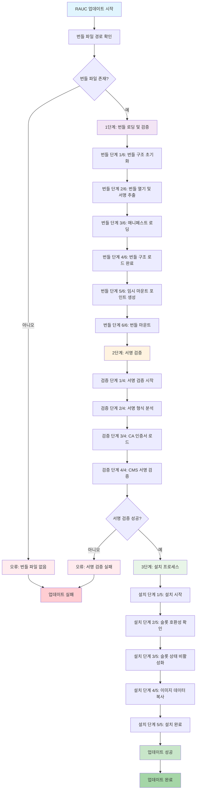
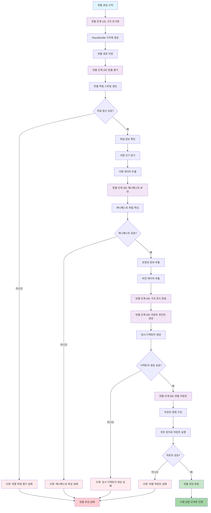
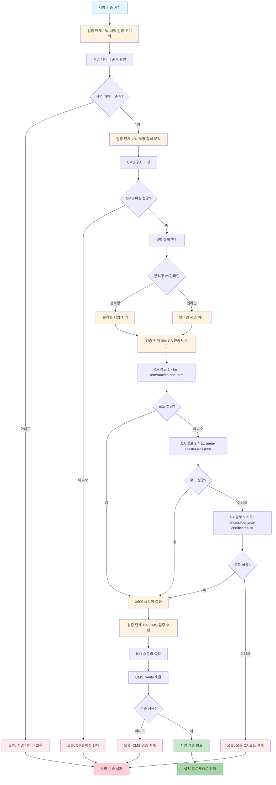
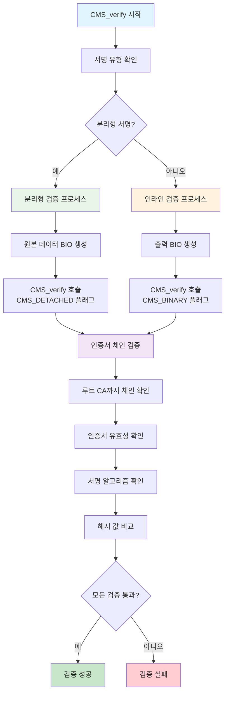
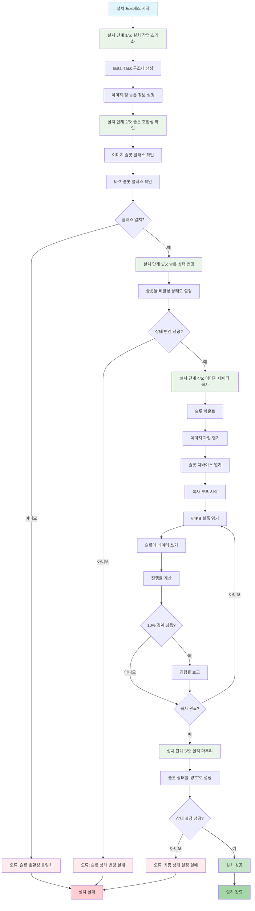
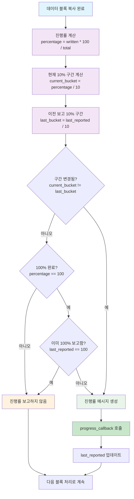
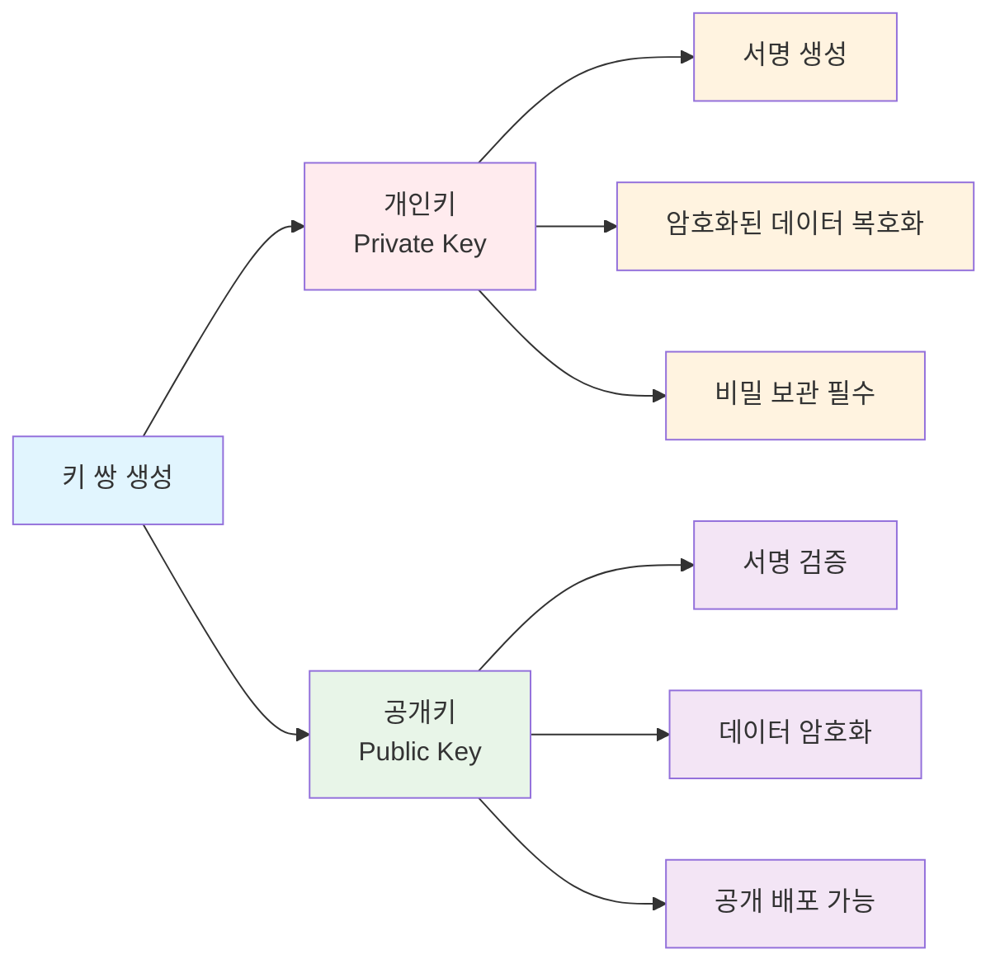
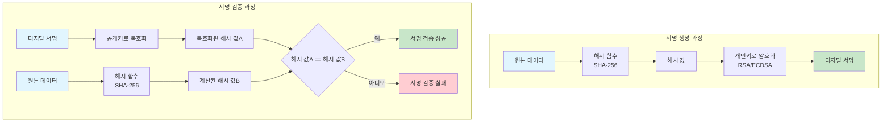
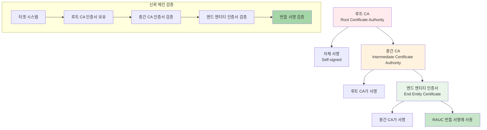
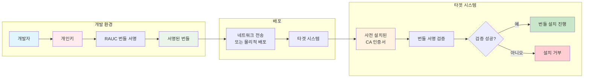

# RAUC 업데이트 프로세스 문서 (한국어)

## 개요

이 문서는 RAUC (Robust Auto-Update Client) 번들 설치의 상세한 단계별 프로세스를 설명합니다. 번들 검증, 서명 유효성 검사, 타겟 슬롯에 대한 이미지 배포를 포함하여 전체적인 업데이트 흐름을 다룹니다.

## 문서의 특징

### 📊 **시각적 플로우차트**
- Mermaid를 이용한 상호작용 플로우차트
- 전체 프로세스 및 단계별 상세 흐름도
- 오류 처리 및 분기 시나리오 포함

### 💻 **실제 코드 기반**
- `kirkstone/local/update-library/src/rauc/` 소스코드 분석
- 실제 함수 호출과 디버그 메시지 포함
- 코드 라인 번호와 파일 경로 참조

### 🔐 **암호화 기초 설명**
- 공개키 암호화, 디지털 서명, 인증서 체인
- CMS (Cryptographic Message Syntax) 상세 분석
- 보안 모델과 신뢰 체인 다이어그램

## 프로세스 흐름

RAUC 업데이트 프로세스는 3개의 주요 단계로 구성됩니다:
1. **번들 로딩 및 검증** (6단계)
2. **서명 검증** (4단계)  
3. **설치 프로세스** (5단계)

### 전체 RAUC 업데이트 프로세스 플로우차트



## 1단계: 번들 로딩 및 검증

### 번들 로딩 및 검증 상세 플로우차트



### [번들 단계 1/6] 번들 로드 및 검증 프로세스 시작
- 번들 구조 초기화
- 번들 경로 설정 및 기본 유효성 검사
- **디버그 출력**: 번들 파일 경로

```c
// kirkstone/local/update-library/src/rauc/bundle.c:190-195
gboolean r_bundle_load(const gchar *bundlename, RaucBundle **bundle, GError **error)
{
    g_print("[번들 단계 1/6] 번들 로드 및 검증 프로세스 시작\n");
    g_print("DEBUG: 번들 파일: %s\n", bundlename);
    
    ibundle = g_new0(RaucBundle, 1);
    ibundle->path = g_strdup(bundlename);
```

**예상 디버그 출력**:
```
[번들 단계 1/6] 번들 로드 및 검증 프로세스 시작
DEBUG: 번들 파일: /data/nuc-image-qt5.raucb
```

### [번들 단계 2/6] 번들 열기 및 서명 데이터 추출
- 번들 파일을 열고 서명 데이터 읽기
- 임베디드 또는 분리된 서명 정보 추출
- **오류 처리**: 번들 파일 접근 유효성 검사

```c
// kirkstone/local/update-library/src/rauc/bundle.c:197-204
g_print("[번들 단계 2/6] 번들 열기 및 서명 데이터 추출\n");
if (!open_local_bundle(ibundle, error)) {
    g_print("ERROR: 번들 파일 열기 실패\n");
    goto out;
}
```

**예상 디버그 출력**:
```
[번들 단계 2/6] 번들 열기 및 서명 데이터 추출
DEBUG: 번들 파일 스트림 생성됨
DEBUG: 서명 크기: 2048 바이트
```

### [번들 단계 3/6] 호환성 확인을 위한 매니페스트 로딩
- 번들 매니페스트 파일 파싱
- 호환성 정보 및 버전 데이터 추출
- **오류 처리**: 매니페스트 파싱 유효성 검사

```c
// kirkstone/local/update-library/src/rauc/bundle.c:206-213
g_print("[번들 단계 3/6] 호환성 확인을 위한 매니페스트 로딩\n");
if (!r_bundle_load_manifest(ibundle, error)) {
    g_print("ERROR: 번들 매니페스트 로드 실패\n");
    goto out;
}
```

**예상 디버그 출력**:
```
[번들 단계 3/6] 호환성 확인을 위한 매니페스트 로딩
DEBUG: 매니페스트 파일 파싱됨
DEBUG: 호환성 문자열: intel-i7-x64-nuc-rauc
```

### [번들 단계 4/6] 번들 구조 성공적으로 로드됨
- 번들 데이터 구조 초기화 완료
- 서명 검증 단계를 위한 준비

```c
// kirkstone/local/update-library/src/rauc/bundle.c:215-216
g_print("[번들 단계 4/6] 번들 구조 성공적으로 로드됨\n");
*bundle = ibundle;
```

### [번들 단계 5/6] 번들을 위한 임시 마운트 포인트 생성
- 번들 마운트를 위한 임시 디렉토리 생성
- **디버그 출력**: 임시 마운트 포인트 경로

```c
// kirkstone/local/update-library/src/rauc/bundle.c:233-240
g_print("[번들 단계 5/6] 번들을 위한 임시 마운트 포인트 생성\n");
tmpdir = g_dir_make_tmp("rauc-bundle-XXXXXX", &ierror);
g_print("DEBUG: 임시 마운트 포인트 생성됨: %s\n", tmpdir);
```

**예상 디버그 출력**:
```
[번들 단계 5/6] 번들을 위한 임시 마운트 포인트 생성
DEBUG: 임시 마운트 포인트 생성됨: /tmp/rauc-bundle-Ab3X9Z
```

### [번들 단계 6/6] 번들을 읽기 전용 루프 장치로 마운트
- 번들 파일을 루프 장치로 마운트
- **디버그 출력**: 마운트 명령 실행
- **성공 출력**: 마운트 포인트 확인

```c
// kirkstone/local/update-library/src/rauc/bundle.c:242-252
g_print("[번들 단계 6/6] 번들을 읽기 전용 루프 장치로 마운트\n");
mount_cmd = g_strdup_printf("mount -o loop,ro '%s' '%s'", bundlename, tmpdir);
printf("DEBUG: 마운트 명령 실행: %s\n", mount_cmd);

g_print("✓ 번들이 성공적으로 마운트됨: %s\n", tmpdir);
```

**예상 디버그 출력**:
```
[번들 단계 6/6] 번들을 읽기 전용 루프 장치로 마운트
DEBUG: 마운트 명령 실행: mount -o loop,ro '/data/nuc-image-qt5.raucb' '/tmp/rauc-bundle-Ab3X9Z'
✓ 번들이 성공적으로 마운트됨: /tmp/rauc-bundle-Ab3X9Z
```

## 2단계: 서명 검증

### 서명 검증 상세 플로우차트



### CMS 검증 내부 프로세스 상세도



### [검증 단계 1/4] 번들 서명 검증 시작
- 서명 검증 프로세스 초기화
- 서명 데이터 존재 유효성 검사
- **디버그 출력**: 서명 데이터 크기

```c
// kirkstone/local/update-library/src/rauc/bundle.c:273-284
g_print("[검증 단계 1/4] 번들 서명 검증 시작\n");
printf("DEBUG: 서명 검증 시작...\n");

if (!bundle->sigdata) {
    g_print("ERROR: 번들 서명 데이터를 찾을 수 없음\n");
    goto out;
}
printf("DEBUG: 서명 데이터 발견, 크기: %zu 바이트\n", g_bytes_get_size(bundle->sigdata));
```

**예상 디버그 출력**:
```
[검증 단계 1/4] 번들 서명 검증 시작
DEBUG: 서명 검증 시작...
DEBUG: 서명 데이터 발견, 크기: 2048 바이트
```

### [검증 단계 2/4] 서명 형식 및 유형 분석
- 서명 유형 결정 (분리형 vs. 인라인)
- CMS 서명 구조 파싱
- **디버그 출력**: 서명 유형 식별

```c
// kirkstone/local/update-library/src/rauc/bundle.c:286-294
g_print("[검증 단계 2/4] 서명 형식 및 유형 분석\n");
if (!cms_is_detached(bundle->sigdata, &detached, &ierror)) {
    g_print("ERROR: 서명 유형 결정 실패\n");
    goto out;
}
printf("DEBUG: 서명 유형: %s\n", detached ? "분리형" : "인라인");
```

**예상 디버그 출력**:
```
[검증 단계 2/4] 서명 형식 및 유형 분석
DEBUG: 서명 유형: 분리형
```

### [검증 단계 3/4] CA 인증서 로드 및 X509 스토어 설정
- 여러 경로에서 CA 인증서 로드 시도:
  - `/etc/rauc/ca.cert.pem`
  - `/home/makepluscode/docker-yocto-kirkstone-nuc/kirkstone/meta-nuc/recipes-core/rauc/files/ca-fixed/ca.cert.pem`
  - `/etc/ssl/certs/ca-certificates.crt`
- **디버그 출력**: CA 로딩 시도 및 결과

```c
// kirkstone/local/update-library/src/rauc/bundle.c:297-327
g_print("[검증 단계 3/4] CA 인증서 로드 및 X509 스토어 설정\n");
const char* ca_paths[] = {
    "/etc/rauc/ca.cert.pem",
    "/home/makepluscode/docker-yocto-kirkstone-nuc/kirkstone/meta-nuc/recipes-core/rauc/files/ca-fixed/ca.cert.pem",
    "/etc/ssl/certs/ca-certificates.crt",
    NULL
};

for (int i = 0; ca_paths[i] != NULL; i++) {
    printf("DEBUG: CA 경로 시도: %s\n", ca_paths[i]);
    store = setup_x509_store(ca_paths[i], NULL, &ierror);
    if (store) {
        printf("DEBUG: CA 로드 성공: %s\n", ca_paths[i]);
        break;
    }
}
printf("DEBUG: X509 스토어 설정 완료\n");
```

**예상 디버그 출력**:
```
[검증 단계 3/4] CA 인증서 로드 및 X509 스토어 설정
DEBUG: CA 경로 시도: /etc/rauc/ca.cert.pem
DEBUG: CA 로드 실패: /etc/rauc/ca.cert.pem - 파일을 찾을 수 없음
DEBUG: CA 경로 시도: /home/makepluscode/docker-yocto-kirkstone-nuc/kirkstone/meta-nuc/recipes-core/rauc/files/ca-fixed/ca.cert.pem
DEBUG: CA 로드 성공: /home/makepluscode/docker-yocto-kirkstone-nuc/kirkstone/meta-nuc/recipes-core/rauc/files/ca-fixed/ca.cert.pem
DEBUG: X509 스토어 설정 완료
```

### [검증 단계 4/4] CMS 서명 검증 수행
- CMS_verify 작업 실행
- 인증서 체인 유효성 검사
- **성공**: 서명 검증 완료

```c
// kirkstone/local/update-library/src/rauc/bundle.c:330-334
g_print("[검증 단계 4/4] CMS 서명 검증 수행\n");
g_message("번들 서명 검증 중... ");
// CMS 검증 로직 계속...
```

**예상 디버그 출력**:
```
[검증 단계 4/4] CMS 서명 검증 수행
번들 서명 검증 중... 
DEBUG: CMS_verify 시작...
DEBUG: CMS_verify 결과: 성공
```

## 3단계: 설치 프로세스

### 설치 프로세스 상세 플로우차트



### 진행률 보고 최적화 플로우차트



### [설치 단계 1/5] '이미지'를 슬롯 '이름'에 설치 시작
- 설치 작업 초기화
- **디버그 출력**: 이미지 파일명 및 타겟 슬롯

```c
// kirkstone/local/update-library/src/rauc/install.c:469-473
if (progress_callback) {
    gchar *message = g_strdup_printf("[설치 단계 1/5] '%s' 이미지를 슬롯 '%s'에 설치 시작",
                                   task->image->filename, task->slot->name);
    progress_callback(0, message, 0, user_data);
    g_free(message);
}
```

**예상 진행률 출력**:
```
[설치 단계 1/5] 'rootfs.ext4' 이미지를 슬롯 'rootfs.1'에 설치 시작: 0%
DEBUG: 이미지 파일: rootfs.ext4
DEBUG: 타겟 슬롯: rootfs.1
```

### [설치 단계 2/5] 슬롯 호환성 확인
- 이미지 요구사항과 슬롯 클래스 호환성 확인
- **진행률**: 5%

```c
// kirkstone/local/update-library/src/rauc/install.c:476-484
if (progress_callback) {
    gchar *message = g_strdup_printf("[설치 단계 2/5] 슬롯 호환성 확인");
    progress_callback(5, message, 0, user_data);
}

if (!verify_slot_compatible(task->slot, task->image, &ierror)) {
    g_propagate_error(error, ierror);
    goto out;
}
```

**예상 진행률 출력**:
```
[설치 단계 2/5] 슬롯 호환성 확인: 5%
DEBUG: 슬롯 클래스 확인: rootfs == rootfs (OK)
```

### [설치 단계 3/5] 슬롯 상태를 비활성으로 업데이트
- 설치 전 타겟 슬롯을 비활성 상태로 표시
- **진행률**: 10%

```c
// kirkstone/local/update-library/src/rauc/install.c:487-495
if (progress_callback) {
    gchar *message = g_strdup_printf("[설치 단계 3/5] 슬롯 상태를 비활성으로 업데이트");
    progress_callback(10, message, 0, user_data);
}

if (!update_slot_status(task->slot, R_SLOT_STATE_INACTIVE, &ierror)) {
    g_propagate_error(error, ierror);
    goto out;
}
```

**예상 진행률 출력**:
```
[설치 단계 3/5] 슬롯 상태를 비활성으로 업데이트: 10%
DEBUG: 슬롯 상태 변경됨: 'rootfs.1' -> 비활성
```

### [설치 단계 4/5] 슬롯에 이미지 데이터 복사
- 타겟 슬롯으로 이미지 데이터 전송 시작
- **진행률**: 15% (시작)부터 90%+ (완료)까지
- **최적화된 출력**: 10% 단위로 진행률 보고 (10%, 20%, 30%, ..., 90%, 100%)

```c
// kirkstone/local/update-library/src/rauc/install.c:498-506
if (progress_callback) {
    gchar *message = g_strdup_printf("[설치 단계 4/5] 슬롯에 이미지 데이터 복사");
    progress_callback(15, message, 0, user_data);
}

if (!copy_image_to_slot(task->image_path, task->slot, progress_callback, user_data, &ierror)) {
    g_propagate_error(error, ierror);
    goto out;
}
```

```c
// kirkstone/local/update-library/src/rauc/install.c:558-570 (진행률 최적화)
if (progress_callback) {
    int percentage = (int)((total_written * 100) / st.st_size);
    static int last_reported = -1;

    // 10%마다 또는 100%에서 진행률 보고
    if ((percentage / 10) != (last_reported / 10) || (percentage == 100 && last_reported != 100)) {
        gchar *message = g_strdup_printf("슬롯 '%s'에 설치 중: %d%%", slot->name, percentage);
        progress_callback(percentage, message, 1, user_data);
        g_free(message);
        last_reported = percentage;
    }
}
```

**예상 진행률 출력**:
```
[설치 단계 4/5] 슬롯에 이미지 데이터 복사: 15%
슬롯 'rootfs.1'에 설치 중: 20%
슬롯 'rootfs.1'에 설치 중: 30%
슬롯 'rootfs.1'에 설치 중: 40%
...
슬롯 'rootfs.1'에 설치 중: 90%
슬롯 'rootfs.1'에 설치 중: 100%
```

### [설치 단계 5/5] 설치 완료 및 슬롯 상태 업데이트
- 설치 프로세스 완료
- 슬롯 상태를 "양호"로 업데이트
- **진행률**: 98%
- **최종 성공**: 100% 완료 메시지

```c
// kirkstone/local/update-library/src/rauc/install.c:508-525
if (progress_callback) {
    gchar *message = g_strdup_printf("[설치 단계 5/5] 설치 완료 및 슬롯 상태 업데이트");
    progress_callback(98, message, 0, user_data);
}

if (!update_slot_status(task->slot, R_SLOT_STATE_GOOD, &ierror)) {
    g_propagate_error(error, ierror);
    goto out;
}

if (progress_callback) {
    gchar *message = g_strdup_printf("슬롯 '%s' 설치가 성공적으로 완료됨", task->slot->name);
    progress_callback(100, message, 1, user_data);
    g_free(message);
}
```

**예상 진행률 출력**:
```
[설치 단계 5/5] 설치 완료 및 슬롯 상태 업데이트: 98%
DEBUG: 슬롯 상태 변경됨: 'rootfs.1' -> 양호
슬롯 'rootfs.1' 설치가 성공적으로 완료됨: 100%
```

## CMS (Cryptographic Message Syntax) 상세 설명

### CMS 기본 개념
CMS는 RFC 5652에서 정의된 암호화 메시지 구문으로, 디지털 서명, 암호화, 메시지 인증 등을 제공하는 표준입니다.

#### CMS 구조
```
CMS 메시지
├── ContentInfo (외부 컨테이너)
│   ├── contentType (서명된 데이터 타입)
│   └── content (실제 서명된 데이터)
├── SignerInfo (서명자 정보)
│   ├── 서명자 식별자
│   ├── 서명 알고리즘
│   ├── 서명된 속성
│   └── 서명 값
└── 인증서 체인
    ├── 서명자 인증서
    └── CA 인증서
```

### RAUC에서의 CMS 검증 프로세스

#### 1. CMS 데이터 파싱
```c
// kirkstone/local/update-library/src/rauc/signature.c:170-177
icms = d2i_CMS_bio(insig, NULL);
if (!icms) {
    printf("DEBUG: CMS 서명 파싱 실패\n");
    g_set_error(error, R_SIGNATURE_ERROR, R_SIGNATURE_ERROR_PARSE,
               "CMS 서명 파싱 실패");
    goto out;
}
printf("DEBUG: CMS 서명 파싱 성공\n");
```

#### 2. 분리형 vs. 인라인 서명 판단
```c
// kirkstone/local/update-library/src/rauc/signature.c:179-180
detached = CMS_is_detached(icms);
printf("DEBUG: 서명 형태: %s\n", detached ? "분리형" : "인라인");
```

- **분리형 (Detached)**: 서명과 데이터가 분리되어 있음 (RAUC에서 주로 사용)
- **인라인 (Inline)**: 서명 안에 데이터가 포함됨

#### 3. BIO 스트림 설정
```c
// kirkstone/local/update-library/src/rauc/signature.c:193-200
if (detached) {
    incontent = BIO_new_mem_buf(g_bytes_get_data(content, NULL), g_bytes_get_size(content));
    if (!incontent) {
        printf("DEBUG: 콘텐츠 BIO 생성 실패\n");
        goto out;
    }
    printf("DEBUG: 콘텐츠 BIO 생성됨\n");
}
```

#### 4. CMS 검증 실행
```c
// kirkstone/local/update-library/src/rauc/signature.c:222-229
printf("DEBUG: CMS_verify 시작...\n");
if (detached) {
    verified = CMS_verify(icms, NULL, store, incontent, NULL, CMS_DETACHED | CMS_BINARY);
} else {
    verified = CMS_verify(icms, NULL, store, NULL, outcontent, CMS_BINARY);
}
printf("DEBUG: CMS_verify 결과: %s\n", verified ? "성공" : "실패");
```

**CMS_verify 함수 매개변수**:
- `icms`: 파싱된 CMS 구조
- `certs`: 추가 인증서 (NULL 사용)
- `store`: X509 인증서 스토어 (CA 인증서 포함)
- `incontent`: 분리형 서명의 원본 데이터
- `out`: 출력 BIO (인라인 서명용)
- `flags`: 검증 플래그 (CMS_DETACHED, CMS_BINARY 등)

### X509 인증서 스토어 설정

```c
// kirkstone/local/update-library/src/rauc/signature.c:55-91
X509_STORE* setup_x509_store(const gchar *capath, const gchar *cadir, GError **error)
{
    X509_STORE *store = X509_STORE_new();
    
    // CA 인증서 로드
    if (capath) {
        if (!X509_STORE_load_locations(store, capath, NULL)) {
            g_set_error(error, R_SIGNATURE_ERROR, R_SIGNATURE_ERROR_UNKNOWN,
                       "CA 인증서 로드 실패: %s", capath);
            goto out;
        }
    }
    
    // 개발 인증서를 위한 완화된 검증 플래그 설정
    X509_STORE_set_flags(store, 0);
    
    return store;
}
```

## 암호화/복호화 기초 지식

### 1. 공개키 암호화 개념도



### 2. 디지털 서명 과정 다이어그램



### 3. 인증서 체인 구조



### 4. RAUC 보안 모델 다이어그램



### 5. 암호화 핵심 개념 요약

**공개키 암호화의 핵심 원리**:
- **개인키**: 서명 생성, 복호화용 (비밀 보관)
- **공개키**: 서명 검증, 암호화용 (공개 배포)
- **디지털 서명**: 데이터 무결성과 인증 보장
- **인증서 체인**: 루트 CA부터 엔드 엔티티까지의 신뢰 관계

**RAUC에서의 적용**:
- CA 인증서가 타겟 시스템에 사전 설치
- 번들은 개발자 인증서로 서명
- 타겟에서 인증서 체인 검증 후 설치 진행

## 디버그 정보 상세

### 서명 검증 상세 로그
```
DEBUG: 서명 검증 시작...
DEBUG: 서명 데이터 발견, 크기: 2048 바이트
DEBUG: 서명 유형: 분리형
DEBUG: CA 경로 시도: /etc/rauc/ca.cert.pem
DEBUG: CA 로드 성공: /etc/rauc/ca.cert.pem
DEBUG: X509 스토어 설정 완료
```

### CMS 검증 프로세스 로그
```
DEBUG: 분리형 서명 처리
DEBUG: 번들 파일 열림, fd: 3, 크기: 1048576
DEBUG: cms_verify_fd: fd=3, limit=1046528, sig_size=2048
DEBUG: CMS_verify 시작...
DEBUG: CMS_verify 결과: 성공
```

### 설치 진행률 로그
```
DEBUG: 10%마다 진행률 보고
슬롯 'rootfs.1'에 설치 중: 0%
슬롯 'rootfs.1'에 설치 중: 10%
슬롯 'rootfs.1'에 설치 중: 20%
...
슬롯 'rootfs.1'에 설치 중: 90%
슬롯 'rootfs.1'에 설치 중: 100%
```

## 오류 처리

### 일반적인 오류 케이스
1. **번들 파일을 찾을 수 없음**: 파일 경로 유효성 검사 실패
2. **서명 검증 실패**: 잘못된 서명 또는 CA 인증서 문제
3. **슬롯 호환성 불일치**: 이미지 슬롯 클래스가 타겟 슬롯과 일치하지 않음
4. **마운트 실패**: 번들 마운트 문제
5. **설치 실패**: 이미지 복사 또는 슬롯 업데이트 오류

### 오류 메시지 형식
```
ERROR: 번들 파일 열기 실패
ERROR: 번들 서명 데이터를 찾을 수 없음
ERROR: 서명 유형 결정 실패
ERROR: 모든 경로에서 CA 인증서 로드 실패
ERROR: 번들 마운트 실패
```

## 설정 구성

### CA 인증서 경로
시스템은 다음 위치에서 순서대로 CA 인증서를 로드를 시도합니다:
1. `/etc/rauc/ca.cert.pem` (주요)
2. 프로젝트 특정 CA: `kirkstone/meta-nuc/recipes-core/rauc/files/ca-fixed/ca.cert.pem`
3. 시스템 CA 번들: `/etc/ssl/certs/ca-certificates.crt`

### 번들 호환성
- 시스템 호환성: `intel-i7-x64-nuc-rauc`
- 번들은 이 호환성 문자열과 정확히 일치해야 함

## 사용법

### 명령줄 인터페이스
```bash
# update-test-app 사용
/usr/local/bin/update-test-app /path/to/bundle.raucb

# 표준 RAUC 사용
rauc install /path/to/bundle.raucb
```

### 예상 출력 흐름
1. 번들 로딩 단계 (1-6/6)
2. 검증 단계 (1-4/4)  
3. 설치 단계 (1-5/5)
4. 진행률 업데이트 (0%, 10%, 20%, ..., 100%)
5. 성공 확인

## 구현 상세

### 핵심 컴포넌트
- **번들 로더**: `src/rauc/bundle.c`의 `r_bundle_load()`
- **서명 검증기**: `src/rauc/bundle.c`의 `r_bundle_verify_signature()`
- **CMS 검증**: `src/rauc/signature.c`의 `cms_verify_fd()` 및 `cms_verify_bytes()`
- **설치 엔진**: `src/rauc/install.c`의 `install_image_to_slot()`

### 진행률 보고 최적화
- **기존**: 모든 퍼센트 변화 보고 (1%, 2%, 3%, ...)
- **최적화**: 10% 단위 + 100% 완료만 (0%, 10%, 20%, ..., 90%, 100%)
- **로직**: `(percentage / 10) != (last_reported / 10)`으로 10% 경계를 넘을 때만 보고
- **특별 케이스**: `percentage == 100 && last_reported != 100`으로 100% 완료 확실히 보고
- **결과**: 가독성을 유지하면서 장황한 출력 줄임

## 문제 해결

### 디버그 모드
다음 사항에 대한 콘솔 출력을 확인하여 상세한 디버깅을 활성화하세요:
- 파일 접근 권한
- CA 인증서 로딩 상태
- 서명 검증 상세 사항
- 마운트 포인트 생성
- 설치 진행률

### 일반적인 해결책
1. **CA 인증서 문제**: 적절한 CA 인증서가 사용 가능한지 확인
2. **호환성 문제**: 번들 호환성 문자열이 시스템과 일치하는지 확인
3. **권한 오류**: 파일 권한 및 마운트 기능 확인
4. **네트워크 문제**: 원격 배포의 경우 SSH 연결 확인

## 관련 문서
- RAUC 공식 문서: https://rauc.readthedocs.io/
- 번들 생성 가이드: `tools/bundler/README.md`
- 배포 스크립트: `kirkstone/local/update-library/deploy.sh`

## 보안 고려사항

### 암호화 강도
- **서명 알고리즘**: RSA-2048 또는 더 높은 수준
- **해시 알고리즘**: SHA-256 이상
- **인증서 유효성**: 만료일 및 폐기 목록 확인

### 키 관리
- **개인키 보호**: 안전한 HSM 또는 보안 저장소 사용
- **인증서 갱신**: 정기적인 인증서 갱신 절차
- **키 회전**: 주기적인 키 교체 정책

### 시스템 보안
- **부트 체인**: 보안 부트를 통한 무결성 보장
- **롤백 보호**: 이전 버전으로의 다운그레이드 방지
- **업데이트 인증**: 승인된 소스에서만 업데이트 허용