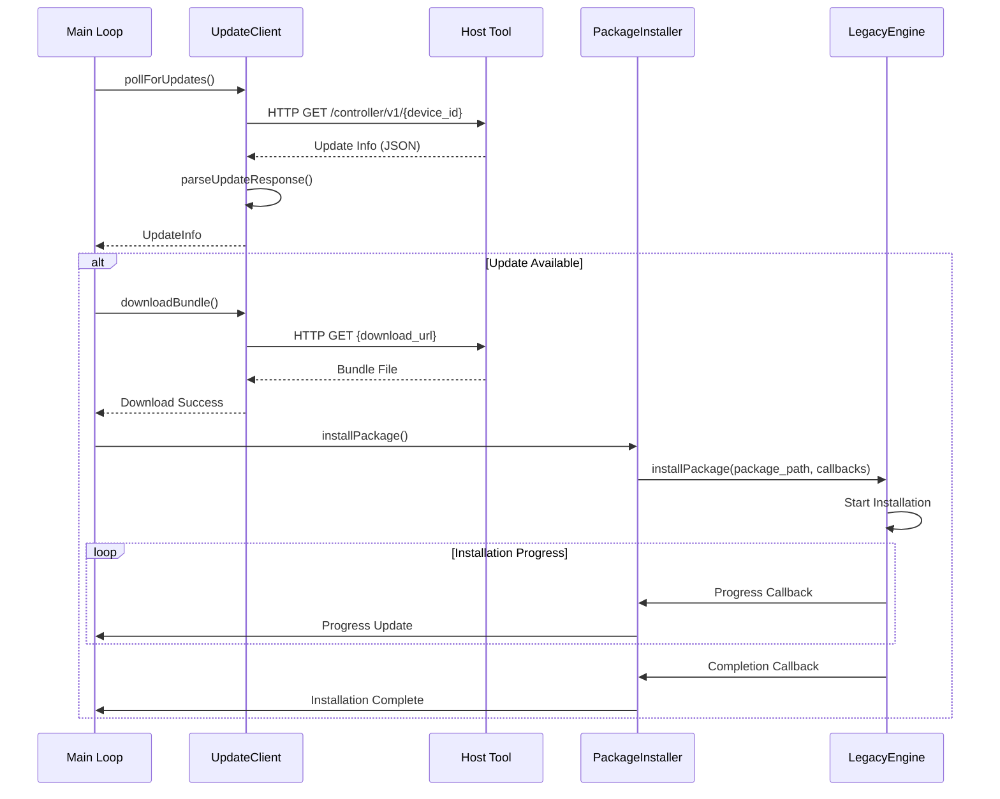
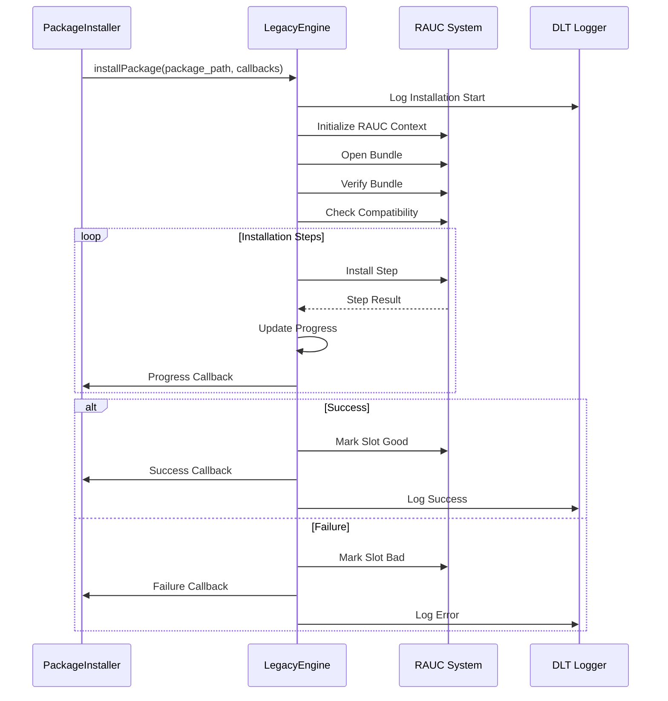
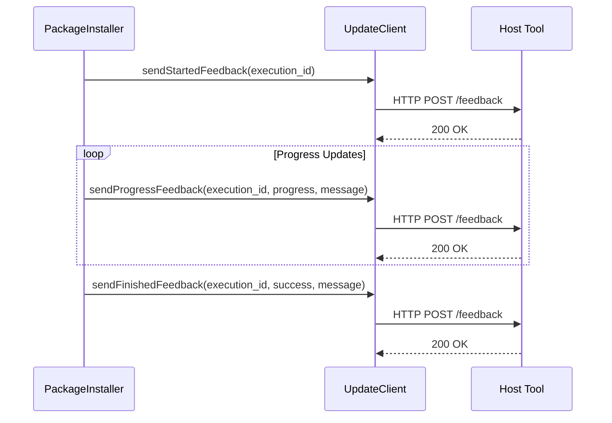

# Update-Agent 아키텍처 문서

## 목차
1. [시스템 개요](#시스템-개요)
2. [아키텍처 개요](#아키텍처-개요)
3. [클래스 다이어그램](#클래스-다이어그램)
4. [시퀀스 다이어그램](#시퀀스-다이어그램)
5. [컴포넌트 상세 설명](#컴포넌트-상세-설명)
6. [데이터 흐름](#데이터-흐름)
7. [설정 및 환경](#설정-및-환경)

## 시스템 개요

Update-Agent는 임베디드 시스템의 자동 업데이트를 관리하는 핵심 컴포넌트입니다. 이 시스템은 다음과 같은 주요 기능을 제공합니다:

- **Host 도구와의 HTTP 통신**: 업데이트 정보 폴링 및 피드백 전송
- **RAUC 패키지 설치**: 시스템 업데이트 번들 설치 및 관리
- **진행률 모니터링**: 실시간 설치 진행 상황 추적
- **상태 관리**: 슬롯 상태, 부팅 슬롯, 호환성 정보 관리

## 아키텍처 개요

Update-Agent는 계층화된 아키텍처를 따르며, 각 계층은 명확한 책임을 가집니다:

```
┌─────────────────────────────────────────────────────────────┐
│                    Application Layer                        │
│  ┌─────────────────┐  ┌─────────────────┐                 │
│  │   Main Loop     │  │  UpdateAgent    │                 │
│  └─────────────────┘  └─────────────────┘                 │
└─────────────────────────────────────────────────────────────┘
┌─────────────────────────────────────────────────────────────┐
│                    Service Layer                            │
│  ┌─────────────────┐  ┌─────────────────┐                 │
│  │ PackageInstaller│  │  UpdateClient   │                 │
│  └─────────────────┘  └─────────────────┘                 │
└─────────────────────────────────────────────────────────────┐
│                    Engine Layer                             │
│  ┌─────────────────┐  ┌─────────────────┐                 │
│  │ LegacyEngine    │  │  RAUC Legacy    │                 │
│  └─────────────────┘  └─────────────────┘                 │
└─────────────────────────────────────────────────────────────┘
┌─────────────────────────────────────────────────────────────┐
│                    System Layer                             │
│  ┌─────────────────┐  ┌─────────────────┐                 │
│  │     DLT         │  │     RAUC        │                 │
│  │   Logging       │  │   System        │                 │
│  └─────────────────┘  └─────────────────┘                 │
└─────────────────────────────────────────────────────────────┘
```

## 클래스 다이어그램

```mermaid
classDiagram
    class UpdateAgent {
        -ServerAgent server_agent_
        -PackageInstaller package_installer_
        -string current_execution_id_
        -bool installation_in_progress_
        -bool installation_started_
        +UpdateAgent()
        +~UpdateAgent()
        +bool initialize()
        +void run()
        -void checkForUpdates()
        -void handleInstallProgress(int progress)
        -void handleInstallCompleted(bool success, string message)
    }

    class UpdateClient {
        -string server_url_
        -string tenant_
        -string device_id_
        -CURL* curl_handle_
        +UpdateClient(string server_url, string tenant, string device_id)
        +~UpdateClient()
        +bool pollForUpdates(string& response)
        +bool downloadBundle(string download_url, string local_path)
        +bool sendFeedback(string execution_id, string status, string message)
        +bool parseUpdateResponse(string response, UpdateInfo& update_info)
        +bool sendProgressFeedback(string execution_id, int progress, string message)
        +bool sendStartedFeedback(string execution_id)
        +bool sendFinishedFeedback(string execution_id, bool success, string message)
        -size_t writeCallback(void* contents, size_t size, size_t nmemb, string* userp)
        -size_t writeFileCallback(void* contents, size_t size, size_t nmemb, FILE* file)
        -string buildPollUrl()
        -string buildFeedbackUrl(string execution_id)
        -void setupDownloadCurlOptions()
        -bool parseDeploymentInfo(json_object* deployment_obj, UpdateInfo& update_info)
        -bool parseArtifactInfo(json_object* artifact_obj, UpdateInfo& update_info)
    }

    class PackageInstaller {
        -unique_ptr<LegacyEngine> update_client_
        -bool connected_
        -function<void(int)> progress_callback_
        -function<void(bool, string)> completed_callback_
        +PackageInstaller()
        +~PackageInstaller()
        +bool connect()
        +void disconnect()
        +bool isConnected()
        +bool checkService()
        +bool installPackage(string package_path)
        +bool installPackageAsync(string package_path)
        +bool getStatus(string& status)
        +bool getBootSlot(string& boot_slot)
        +bool markGood()
        +bool markBad()
        +bool getPackageInfo(string package_path, string& info)
        +void setProgressCallback(function<void(int)> callback)
        +void setCompletedCallback(function<void(bool, string)> callback)
        +void processMessages()
        -void onProgressCallback(ProgressInfo& progress)
        -void onCompletedCallback(InstallResult result, string message)
    }

    class LegacyEngine {
        -bool initialized_
        -bool installing_
        -ProgressInfo current_progress_
        -string last_error_
        -string current_operation_
        -ProgressCallback progress_callback_
        -CompletedCallback completed_callback_
        +LegacyEngine()
        +~LegacyEngine()
        +bool initialize(string config_file_path)
        +bool installPackage(string package_path, ProgressCallback progress_cb, CompletedCallback completed_cb)
        +vector<SlotInfo> getSlotStatus()
        +string getBootSlot()
        +string getCompatible()
        +ProgressInfo getCurrentProgress()
        +string getLastError()
        +string getOperation()
        +bool getPackageInfo(string package_path, string& compatible, string& version)
        +bool isInstalling()
        -void onInstallProgress(int percentage, string message)
        -void onInstallCompleted(RInstallResult result, string message)
    }

    class UpdateInfo {
        +string execution_id
        +string download_url
        +string version
        +string description
        +string filename
        +long expected_size
        +string md5_hash
        +string sha1_hash
        +string sha256_hash
        +bool is_available
        +UpdateInfo()
    }

    class ProgressInfo {
        +int percentage
        +string message
        +int nesting_depth
        +ProgressInfo()
        +ProgressInfo(int p, string m, int d)
    }

    class SlotInfo {
        +string slot_name
        +map<string, string> properties
        +SlotInfo()
        +SlotInfo(string name)
    }

    enum InstallResult {
        SUCCESS
        FAILURE
        CANCELLED
    }

    UpdateAgent --> UpdateClient : uses
    UpdateAgent --> PackageInstaller : uses
    PackageInstaller --> LegacyEngine : uses
    UpdateClient --> UpdateInfo : creates/uses
    LegacyEngine --> ProgressInfo : creates/uses
    LegacyEngine --> SlotInfo : creates/uses
    LegacyEngine --> InstallResult : uses
    PackageInstaller --> ProgressInfo : uses
    PackageInstaller --> InstallResult : uses
```

## 시퀀스 다이어그램

### 1. 업데이트 폴링 및 다운로드 시퀀스



### 2. 패키지 설치 시퀀스



### 3. 피드백 전송 시퀀스



## 컴포넌트 상세 설명

### 1. UpdateAgent (메인 애플리케이션)

**책임**: 전체 업데이트 프로세스 조정 및 메인 루프 관리

**주요 기능**:
- 업데이트 폴링 주기 관리
- 설치 상태 모니터링
- 진행률 및 완료 콜백 처리
- 예외 상황 처리 및 복구

**핵심 메서드**:
```cpp
void run()                    // 메인 루프 실행
void checkForUpdates()        // 업데이트 확인
void handleInstallProgress()  // 설치 진행률 처리
void handleInstallCompleted() // 설치 완료 처리
```

### 2. UpdateClient (HTTP 통신 클라이언트)

**책임**: Host 도구와의 HTTP 통신 및 업데이트 정보 관리

**주요 기능**:
- 서버로부터 업데이트 정보 폴링
- 업데이트 번들 다운로드
- 설치 진행 상황 피드백 전송
- JSON 응답 파싱

**핵심 메서드**:
```cpp
bool pollForUpdates()         // 업데이트 정보 폴링
bool downloadBundle()         // 번들 다운로드
bool sendFeedback()           // 피드백 전송
bool parseUpdateResponse()    // 응답 파싱
```

### 3. PackageInstaller (패키지 설치 관리자)

**책임**: RAUC 엔진과의 인터페이스 및 설치 프로세스 관리

**주요 기능**:
- LegacyEngine 연결 관리
- 설치 진행률 콜백 처리
- 설치 상태 모니터링
- 오류 처리 및 복구

**핵심 메서드**:
```cpp
bool connect()                // 엔진 연결
bool installPackage()         // 패키지 설치
bool checkService()           // 서비스 상태 확인
void setProgressCallback()    // 진행률 콜백 설정
```

### 4. LegacyEngine (RAUC 엔진 래퍼)

**책임**: RAUC 시스템과의 직접 통신 및 패키지 설치 실행

**주요 기능**:
- RAUC 컨텍스트 초기화
- 번들 검증 및 설치
- 진행률 추적
- 슬롯 상태 관리

**핵심 메서드**:
```cpp
bool initialize()             // 엔진 초기화
bool installPackage()         // 패키지 설치 실행
ProgressInfo getCurrentProgress() // 현재 진행률
vector<SlotInfo> getSlotStatus() // 슬롯 상태
```

## 데이터 흐름

### 1. 업데이트 정보 흐름

```
Host Tool → UpdateClient → UpdateInfo → Main Loop → PackageInstaller
```

1. **Host Tool**: 업데이트 정보 제공 (JSON)
2. **UpdateClient**: HTTP 응답 수신 및 파싱
3. **UpdateInfo**: 구조화된 업데이트 정보
4. **Main Loop**: 업데이트 정보 처리 결정
5. **PackageInstaller**: 설치 프로세스 시작

### 2. 설치 진행률 흐름

```
LegacyEngine → PackageInstaller → Main Loop → UpdateClient → Host Tool
```

1. **LegacyEngine**: RAUC 설치 진행률 감지
2. **PackageInstaller**: 진행률 콜백 처리
3. **Main Loop**: 진행률 정보 수집
4. **UpdateClient**: 피드백 전송
5. **Host Tool**: 진행률 정보 수신

### 3. 오류 처리 흐름

```
Error Source → Error Handler → Logging → Recovery Action
```

1. **Error Source**: RAUC, HTTP, 파일 시스템 등
2. **Error Handler**: 오류 정보 수집 및 분석
3. **Logging**: DLT를 통한 로그 기록
4. **Recovery Action**: 자동 복구 또는 사용자 알림

## 설정 및 환경

### 1. 빌드 설정

**CMake 구성**:
- C++14 표준 사용
- DLT 로깅 지원
- libcurl HTTP 클라이언트
- json-c JSON 파싱
- RAUC 레거시 라이브러리

**의존성**:
```cmake
find_package(PkgConfig REQUIRED)
pkg_check_modules(DLT REQUIRED automotive-dlt)
pkg_check_modules(CURL REQUIRED libcurl)
pkg_check_modules(JSON REQUIRED json-c)
pkg_check_modules(GLIB REQUIRED glib-2.0)
pkg_check_modules(GIO REQUIRED gio-2.0)
```

### 2. 런타임 설정

**환경 변수**:
```bash
HOST_SERVER_URL=https://host-tool.example.com
HOST_TENANT=default
DEVICE_ID=device-001
POLL_INTERVAL_SECONDS=300
DOWNLOAD_TIMEOUT_SECONDS=300
HTTP_TIMEOUT_SECONDS=30
```

**설정 파일**:
- `/etc/rauc/system.conf`: RAUC 시스템 설정
- `/etc/update-agent/config.conf`: Update-Agent 설정

### 3. 로깅 설정

**DLT 컨텍스트**:
- `MAIN`: 메인 애플리케이션 로그
- `UCLI`: UpdateClient HTTP 통신 로그
- `PKGI`: PackageInstaller 로그
- `LENG`: LegacyEngine RAUC 로그

**로그 레벨**:
- `INFO`: 일반 정보
- `WARN`: 경고 메시지
- `ERROR`: 오류 메시지
- `DEBUG`: 디버그 정보

## 성능 및 최적화

### 1. 메모리 관리

- **스마트 포인터**: `unique_ptr`를 사용한 자동 메모리 관리
- **RAII**: 리소스 획득 시 초기화 패턴
- **콜백 래핑**: 람다 함수를 통한 효율적인 콜백 처리

### 2. 네트워크 최적화

- **연결 재사용**: CURL 핸들 재사용
- **타임아웃 설정**: 적절한 네트워크 타임아웃
- **에러 재시도**: 네트워크 오류 시 자동 재시도

### 3. 설치 최적화

- **비동기 처리**: 설치 프로세스의 비동기 실행
- **진행률 추적**: 실시간 진행률 모니터링
- **상태 관리**: 효율적인 설치 상태 추적

## 보안 고려사항

### 1. 인증 및 권한

- **HTTPS 통신**: TLS를 통한 보안 통신
- **인증 토큰**: Host 도구와의 인증
- **파일 권한**: 업데이트 파일의 적절한 권한 설정

### 2. 데이터 검증

- **해시 검증**: MD5, SHA1, SHA256 해시 검증
- **파일 크기 검증**: 다운로드된 파일 크기 확인
- **호환성 검증**: 시스템 호환성 확인

### 3. 오류 처리

- **안전한 실패**: 오류 시 시스템 안전성 보장
- **롤백 지원**: 설치 실패 시 이전 상태로 복구
- **감사 로그**: 모든 작업의 상세한 로그 기록

## 확장성 및 유지보수

### 1. 모듈화 설계

- **단일 책임 원칙**: 각 클래스의 명확한 책임
- **의존성 주입**: 테스트 가능한 구조
- **인터페이스 분리**: 클라이언트별 인터페이스

### 2. 테스트 지원

- **모킹 지원**: HTTP 및 D-Bus 모킹
- **단위 테스트**: 각 컴포넌트별 테스트
- **통합 테스트**: 전체 시스템 테스트

### 3. 설정 관리

- **환경별 설정**: 개발/테스트/운영 환경별 설정
- **동적 설정**: 런타임 설정 변경 지원
- **설정 검증**: 설정값 유효성 검증

이 문서는 Update-Agent 시스템의 전체적인 아키텍처와 동작 방식을 설명합니다. 각 컴포넌트의 역할과 상호작용을 이해하여 시스템을 효과적으로 개발하고 유지보수할 수 있습니다. 